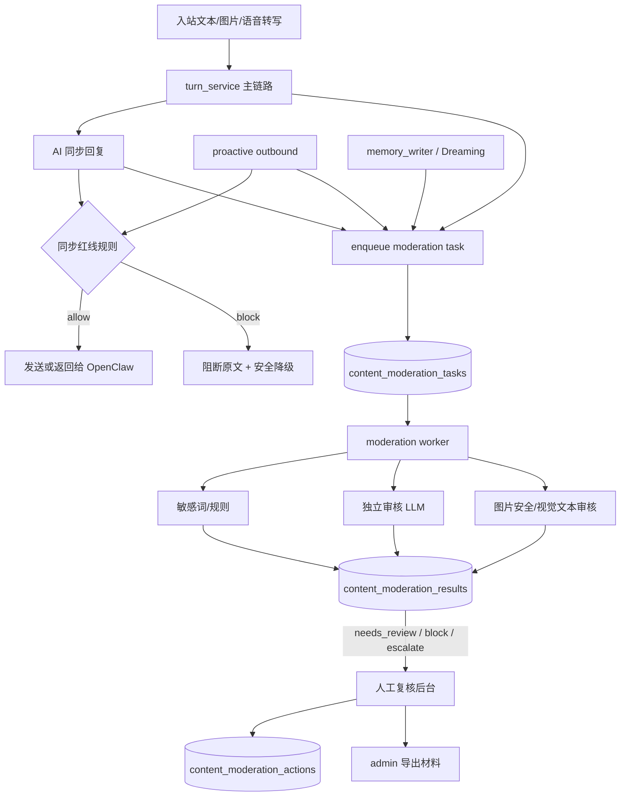
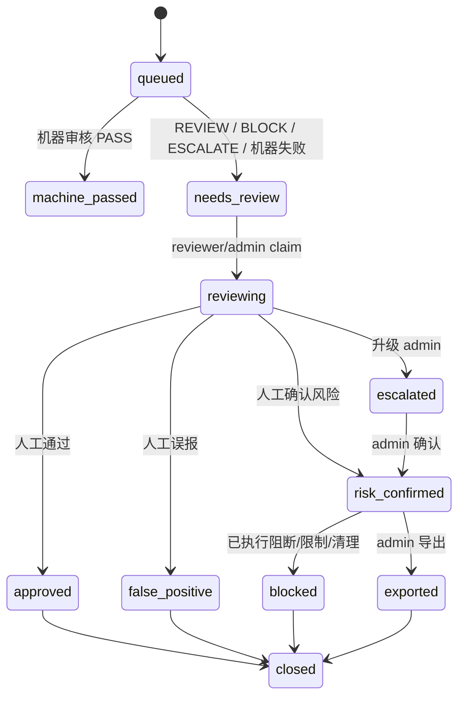

# 内容审核与人工复核技术设计

更新时间：2026-06-15

本文承接 [内容审核与人工复核 PRD](../../product/content_moderation_prd.md)，定义文本、图片、语音转写文本、AI 出站回复、主动消息和记忆产物的审核技术方案。

核心设计：主对话链路只做低成本同步红线拦截；完整机器审核和人工复核全部通过持久化任务异步执行。所有任务、结果、导出和处置必须带 `account_id`，不能绕过现有账号隔离和后台明文审计。

## 1. 当前代码基线

已有可复用基础：

- `app.turn_service.handle_openclaw_turn()` 是普通微信入站 turn 入口。
- `messages` 表已经按 `account_id`、`session_id` 存储入站和同步出站消息。
- `outbound_messages` 表已经承载主动消息 ledger，`app.products.zhaoxi.proactive.messaging.send_proactive_text()` 统一创建、claim、发送并写回 delivery message。
- `app.image_understanding.describe_image()` 已支持 DashScope `qwen3-vl-plus` 图片多维描述；`OpenClawTurnRequest` 已有 `message_type` 和 `media` 字段。
- 语音输入已按上游转写文本进入普通文本链路；无转写时不会让主模型猜测。
- 后台已存在 `admin_users`、`admin_plaintext_grants`、`admin_access_events`，当前角色至少有 `admin/staff`。
- Admin/Debug 视图已有脱敏和明文审计基础，详见 [隐私与后台访问控制技术设计](privacy_admin_access_control_design.md)。
- Dreaming 已有 `dreaming_runs`、`dreaming_memory_items`、`memory_events`。

第一阶段已落地能力：

- `app/db.py` 已增加审核任务、机器结果、人工操作、导出记录和账号风险状态的 schema 与 helper。
- `app/platform/moderation/` 已包含 `models.py`、`policy.py`、`sensitive_words.py`、`service.py`、`worker.py`、`llm_review.py`、`image_review.py`、`export.py`。
- `data/moderation/sensitive_terms.json` 已接入测试敏感词，用于验证 `review/block/escalate`。
- `turn_service.py` 已在入站文本、同步出站回复创建审核任务；出站同步红线命中时使用安全兜底回复。
- `app/products/zhaoxi/proactive/messaging.py` 已接入主动消息出站审核和同步阻断。
- `scripts/run_moderation_worker.py` 已提供独立 worker 入口。
- `/admin/moderation/*` 已提供队列、详情、领取、人工结论、管理员处置、导出、统计和策略只读 API。
- `ADMIN_REVIEWER_TOKEN` 已映射 reviewer 角色；reviewer 只能访问审核队列和详情处理能力。
- `app/static/moderation_admin.html` 已提供第一版审核后台，入口在 `/ops/index.html` 和 `/ops/moderation_admin.html`。
- 审核队列列表默认不返回 `snapshot_text`；详情、结论和导出写入 `admin_access_events`。

第一阶段保留缺口：

- 具体处置策略矩阵未定，当前只提供人工操作能力，不自动固化业务处置。
- 外部审核 LLM 和图片安全模型默认关闭，生产 provider、价格和阈值待确认。
- 记忆、daily notes、Dreaming item 的风险过滤和回滚入口后置。
- 生产敏感词库、更新流程、灰度发布和误报回滚机制待确认。
- 审核 SLA、保留周期、正式报告模板和法务口径待确认。

## 2. 设计目标

- 普通入站和异步机器审核不阻塞对话。
- 出站内容在发送前执行高置信规则同步拦截，命中 `BLOCK` 时原文不发送。
- 所有消息和内部产物都能创建可追踪审核任务。
- 敏感词/规则 100% 执行；LLM 审核按策略抽检或风险触发。
- 主动消息 100% 创建审核任务，并在发送前执行同步红线拦截。
- 人工后台复用现有 admin auth 和 `admin_access_events` 审计，不做新的明文绕过通道。
- reviewer 只能处理审核队列；admin 管理策略、角色、导出和账号处置。

## 3. 总体架构



关键边界：

- `SyncGuard` 只能使用确定性高置信规则和本地敏感词，不调用 LLM。
- `Worker` 可以调用审核 LLM 和图片安全模型，但只消费持久化任务，不在请求线程中执行。
- 人工后台详情页读取审核任务最小必要内容，并写入 `admin_access_events`。

## 4. 模块划分

新增包：

```text
app/platform/moderation/
  __init__.py
  models.py              # 枚举、dataclass、公共类型
  policy.py              # 抽检策略、风险状态、短文本跳过
  sensitive_words.py     # 敏感词/规则加载与同步判定
  service.py             # enqueue、source resolver、状态流转
  worker.py              # claim queued tasks，执行机器审核
  llm_review.py          # 独立审核 LLM OpenAI-compatible client
  image_review.py        # 图片安全模型/图片派生文本审核封装
  # admin.py             # 未单独建文件:admin/reviewer API 已并入 app/main.py
  export.py              # 导出材料包
```

新增脚本：

```text
scripts/run_moderation_worker.py
```

新增数据目录：

```text
data/moderation/sensitive_terms.json
data/moderation_exports/
```

说明：

- 不引入新依赖，HTTP 调用复用 `httpx`。
- 敏感词文件用 JSON，避免 YAML 依赖。
- Admin API 初期可直接写在 `app/main.py`，稳定后再拆 router。

## 5. 配置项

新增 `.env.example` 配置，所有变量必须有行内注释。

```text
MODERATION_ENABLED=true
MODERATION_SYNC_GUARD_ENABLED=true
MODERATION_WORKER_ENABLED=false
MODERATION_WORKER_BATCH_SIZE=50
MODERATION_WORKER_INTERVAL_SECONDS=5

MODERATION_SENSITIVE_TERMS_PATH=data/moderation/sensitive_terms.json
MODERATION_SHORT_TEXT_SKIP_CHARS=8
MODERATION_INBOUND_SAMPLE_PERCENT=15
MODERATION_OUTBOUND_SAMPLE_PERCENT=30
MODERATION_PROACTIVE_SAMPLE_PERCENT=100

MODERATION_LLM_ENABLED=false
MODERATION_LLM_BASE_URL=        # legacy ignored；审核 LLM 复用全局默认 provider
MODERATION_LLM_API_KEY=         # legacy ignored
MODERATION_LLM_MODEL=           # legacy ignored
MODERATION_LLM_TIMEOUT_SECONDS=20 # legacy ignored；使用全局 LLM timeout/provider 配置
MODERATION_LLM_PROMPT_VERSION=moderation_llm_v1

MODERATION_IMAGE_SAFETY_ENABLED=false
MODERATION_IMAGE_SAFETY_MODEL=
MODERATION_EXPORT_DIR=data/moderation_exports
MODERATION_SAFE_FALLBACK_TEXT=这条内容我不能继续发送，我们换个安全的话题吧。
MODERATION_BLOCKED_PLACEHOLDER=[blocked by moderation]
```

抽检比例解释：

- 敏感词/规则始终 100% 执行。
- 上述比例控制 LLM 审核抽检。
- 主动消息默认 LLM 审核 100%。
- 图片本体安全模型如果开启，图片消息默认 100% 执行；图片派生文本再按入站抽检策略进入 LLM 审核。

## 6. 数据模型

### 6.1 content_moderation_tasks

```text
content_moderation_tasks
- id TEXT PRIMARY KEY
- account_id TEXT NOT NULL
- session_id INTEGER
- source_type TEXT NOT NULL
  -- message | outbound_message | generated_reply | daily_note | dreaming_run | dreaming_memory_item
- source_id TEXT NOT NULL
- message_db_id INTEGER
- outbound_message_id INTEGER
- direction TEXT NOT NULL
  -- inbound | outbound | internal
- content_kind TEXT NOT NULL
  -- text | image | image_description | voice_transcript | memory | system_generated
- status TEXT NOT NULL DEFAULT 'queued'
  -- queued | machine_passed | needs_review | reviewing | approved | false_positive
  -- risk_confirmed | blocked | escalated | exported | closed
- risk_level TEXT NOT NULL DEFAULT 'unknown'
  -- unknown | pass | review | block | escalate
- risk_categories_json TEXT NOT NULL DEFAULT '[]'
- confidence REAL
- content_hash TEXT
- snapshot_text TEXT
- media_json TEXT NOT NULL DEFAULT '{}'
- sampling_reason TEXT
- sample_rate_percent INTEGER
- policy_version TEXT NOT NULL
- prompt_version TEXT
- machine_attempts INTEGER NOT NULL DEFAULT 0
- machine_claimed_at TEXT
- machine_completed_at TEXT
- assigned_admin_user_id TEXT
- reviewed_by_admin_user_id TEXT
- reviewed_at TEXT
- last_error TEXT
- idempotency_key TEXT NOT NULL UNIQUE
- metadata_json TEXT NOT NULL DEFAULT '{}'
- created_at TEXT NOT NULL DEFAULT ...
- updated_at TEXT NOT NULL DEFAULT ...
```

索引：

```text
ix_content_moderation_tasks_account_created(account_id, created_at)
ix_content_moderation_tasks_status_created(status, created_at)
ix_content_moderation_tasks_source(source_type, source_id)
ix_content_moderation_tasks_review_queue(status, risk_level, created_at)
```

字段说明：

- `snapshot_text` 是审核快照，可能包含正文，只允许 moderation 详情、导出和机器审核使用。
- 对低风险 `machine_passed` 任务可以只保留 hash 和 source 引用；保留策略后续由数据保留策略决定。
- 图片任务的 `media_json` 只保存媒体引用、hash、format、size，不在日志中写原图字节。
- `idempotency_key` 示例：`message:{account_id}:{message_db_id}:inbound`、`outbound:{account_id}:{outbound_id}`、`generated_reply:{account_id}:{reply_message_id}:pre_send`。

### 6.2 content_moderation_results

```text
content_moderation_results
- id INTEGER PRIMARY KEY AUTOINCREMENT
- task_id TEXT NOT NULL
- account_id TEXT NOT NULL
- reviewer_type TEXT NOT NULL
  -- rule | llm | image_safety | system
- engine TEXT
- engine_version TEXT
- result_level TEXT NOT NULL
  -- pass | review | block | escalate | error
- categories_json TEXT NOT NULL DEFAULT '[]'
- confidence REAL
- matched_terms_json TEXT NOT NULL DEFAULT '[]'
- reason TEXT
- raw_result_json TEXT NOT NULL DEFAULT '{}'
- latency_ms INTEGER
- error TEXT
- created_at TEXT NOT NULL DEFAULT ...
```

索引：

```text
ix_content_moderation_results_task(task_id, id)
ix_content_moderation_results_account_created(account_id, created_at)
```

### 6.3 content_moderation_actions

```text
content_moderation_actions
- id INTEGER PRIMARY KEY AUTOINCREMENT
- task_id TEXT NOT NULL
- account_id TEXT NOT NULL
- admin_user_id TEXT
- action TEXT NOT NULL
  -- claim | approve | mark_false_positive | confirm_risk | block
  -- escalate | close | restrict_proactive | disable_account | clear_memory | export
- previous_status TEXT
- next_status TEXT
- reason TEXT
- metadata_json TEXT NOT NULL DEFAULT '{}'
- created_at TEXT NOT NULL DEFAULT ...
```

所有人工操作同时写入 `admin_access_events`：

```text
action = moderation.<action>
resource_type = moderation_task | moderation_export | moderation_policy
resource_id = task_id/export_id/policy_id
account_id = task.account_id
plaintext = true/false
```

### 6.4 content_moderation_exports

```text
content_moderation_exports
- id TEXT PRIMARY KEY
- task_id TEXT NOT NULL
- account_id TEXT NOT NULL
- admin_user_id TEXT NOT NULL
- reason TEXT NOT NULL
- status TEXT NOT NULL DEFAULT 'created'
- artifact_path TEXT
- artifact_json TEXT NOT NULL DEFAULT '{}'
- created_at TEXT NOT NULL DEFAULT ...
```

MVP 可以先生成 JSON 或 Markdown 文件到 `data/moderation_exports/`，不挂静态公网目录。

### 6.5 moderation_account_risk_state

```text
moderation_account_risk_state
- account_id TEXT PRIMARY KEY
- risk_level TEXT NOT NULL DEFAULT 'normal'
  -- normal | elevated | restricted | disabled
- risk_score INTEGER NOT NULL DEFAULT 0
- sample_multiplier REAL NOT NULL DEFAULT 1.0
- proactive_blocked_until TEXT
- conversation_blocked_until TEXT
- last_risk_at TEXT
- metadata_json TEXT NOT NULL DEFAULT '{}'
- created_at TEXT NOT NULL DEFAULT ...
- updated_at TEXT NOT NULL DEFAULT ...
```

用于后续按用户风险提高抽检比例、限制主动消息或限制账号。

## 7. 状态机



机器 worker claim 规则：

- worker 原子设置 `machine_claimed_at`、`machine_attempts = machine_attempts + 1`。
- `status` 保持 `queued`，避免增加产品态；超过超时窗口的 claimed task 可重新 claim。
- 多次失败后设置 `status='needs_review'`，`last_error='machine_review_failed'`。

## 8. 同步红线拦截

### 8.1 判定范围

同步拦截只覆盖出站：

- `turn_service` 中主模型生成的同步回复。
- `app.products.zhaoxi.proactive.messaging.enqueue_proactive_text()` 中准备发送的主动消息。
- 未来图片生成或其他出站媒体。

入站不做同步阻断，避免影响用户消息接收和回复延迟；入站只做异步任务和风险状态更新。

### 8.2 实现接口

```python
from app.platform.moderation.sensitive_words import check_sync_guard

decision = check_sync_guard(
    account_id=account_id,
    text=reply,
    direction="outbound",
    content_kind="text",
    source_type="generated_reply",
    source_id=reply_message_id,
)
```

返回：

```text
SyncModerationDecision
- allowed: bool
- level: pass | block | escalate
- categories: list[str]
- matched_terms: list[dict]
- reason: str
- policy_version: str
```

### 8.3 turn_service 挂点

位置：`generate_reply_with_tools()` 或 `generate_reply()` 返回后、`insert_message(direction='outbound')` 和 response 返回前。

流程：

1. 对原始 `reply` 执行 `check_sync_guard()`。
2. 允许：正常写入 `messages`，并创建异步审核任务。
3. 阻断：创建 `content_moderation_tasks(source_type='generated_reply')`，`status='blocked'` 或 `needs_review`；`snapshot_text` 保存原始 reply。
4. 将实际发送给用户的 `reply` 替换为 `settings.moderation_safe_fallback_text`。
5. `messages.content` 只写安全降级回复，不写被阻断原文。
6. `messages.raw_json.metadata` 写 `moderation_task_id` 和 `moderation_blocked=true`。

### 8.4 主动消息挂点

位置：`app.products.zhaoxi.proactive.messaging.enqueue_proactive_text()` 中 outbound policy 通过后、`create_outbound_message()` 前。

流程：

1. 对 `text` 执行同步红线检查。
2. 允许：创建原始 outbound，状态 `pending`，并创建异步审核任务。
3. 阻断：创建 moderation task 保存原文；创建 `outbound_messages` 记录，`status='cancelled'`，`text=settings.moderation_blocked_placeholder`，`policy_reason='moderation_sync_blocked'`。
4. 不调用 `send_weixin_text()`。

说明：

- 主动消息阻断默认静默取消，不给用户补发降级话术。
- 用户提醒属于用户明确设置内容，仍要同步拦截；命中时取消该次投递并进入人工复核。

## 9. 异步审核任务创建

### 9.1 入站任务

`turn_service` 在 `insert_message(direction='inbound')` 成功后调用：

```python
enqueue_message_for_moderation(
    message_db_id=inserted_id,
    account_id=account_id,
    session_id=session["id"],
    direction="inbound",
    content_kind=payload.message_type,
    text=text,
    media=payload.media,
    raw=payload.raw,
)
```

要求：

- enqueue 只做 DB insert 和采样决策，不调用 LLM。
- 对图片消息，`media_json` 必须保存 `path/url/format/media_id` 的脱敏引用和文件 hash。
- 如果 `payload.message_type == "voice"`，`content_kind='voice_transcript'`。

### 9.2 同步出站任务

`turn_service` 在最终 `reply` 写入 `messages(direction='outbound')` 后创建审核任务：

```python
enqueue_message_for_moderation(
    message_db_id=outbound_message_db_id,
    direction="outbound",
    content_kind="text",
    text=reply,
)
```

如果同步红线已阻断：

- 原始 reply 的任务在 pre-send 阶段已创建。
- 安全降级回复仍可以创建普通出站审核任务，但采样策略可跳过 LLM。

### 9.3 主动消息任务

`enqueue_proactive_text()` 创建 `outbound_messages` 后调用：

```python
enqueue_outbound_for_moderation(outbound_message_id=outbound["id"])
```

主动消息默认 `sample_rate_percent=100`。

### 9.4 记忆和 Dreaming 任务

MVP 两个挂点：

- `memory_writer.write_memory()` 写 daily note 前或后，对本轮 `turns` 创建 `source_type='daily_note'` 任务。
- Dreaming 生成 `dreaming_memory_items` 后，对每个 item 创建 `source_type='dreaming_memory_item'` 任务。

处置规则：

- 高风险 daily note 不应被后续 prompt 检索装载。
- 高风险 `dreaming_memory_item` 应设置 `apply_status='skipped'` 或禁止注入。
- 已应用后被人工确认风险的 item 通过既有 `memory_events` rollback 或冻结逻辑处理。

## 10. 抽检策略

`app.platform.moderation.policy.should_run_llm_review()` 输入：

```text
account_id
direction
content_kind
source_type
source_id
text_length
risk_state
rule_decision
created_at
```

规则：

- 规则命中 `block/escalate`：100% 进入人工队列，可不再调用 LLM。
- 规则命中 `review`：100% 调 LLM 审核，除非 LLM 服务关闭。
- 主动消息：LLM 抽检 100%。
- 出站普通回复：默认 30%。
- 入站普通文本：默认 15%。
- 极短文本：可跳过 LLM，但不能跳过规则；风险用户不适用短文本跳过。
- 图片：图片安全模型开启时 100% 审核图片本体；图片描述文本再按入站策略抽检。
- 高风险用户：`sample_rate = min(100, base_rate * sample_multiplier)`。

抽样必须可重复：

```text
bucket = sha256(policy_version + account_id + source_type + source_id).int % 100
selected = bucket < sample_rate
```

这样重试不会改变抽检结果。

## 11. 机器审核 Worker

### 11.1 运行方式

```bash
.venv/bin/python scripts/run_moderation_worker.py
```

建议和 proactive scheduler、dreaming scheduler 一样独立进程运行。FastAPI in-process 只用于本地开发，不作为生产默认。

### 11.2 Worker 流程

```text
scan queued tasks
-> atomic claim stale/unclaimed task
-> resolve source/snapshot
-> run sensitive rules
-> maybe run image safety
-> maybe run LLM review
-> write content_moderation_results
-> aggregate decision
-> update task status/risk
-> update moderation_account_risk_state
-> maybe apply automatic internal block
```

聚合优先级：

```text
ESCALATE > BLOCK > REVIEW > PASS
```

状态映射：

- 全部 pass：`machine_passed`。
- 任一 review/block/escalate：`needs_review`。
- 机器失败超过阈值：`needs_review` + `last_error='machine_review_failed'`。

### 11.3 审核 LLM

审核 LLM 不复用主聊天人设和上下文，但模型调用复用统一 LLM 入口，按 family×tier 路由：

```text
tier_for_task("moderation") = flash 档
active family 的 flash provider（可被 LLM_TASK_TIERS 或后台 tier override 调整）
```

调用输入只包含：

- 审核标准 system prompt。
- 待审核内容。
- 必要最小上下文，例如前后 1-3 条消息的脱敏或原文片段。
- 内容方向、类型、来源。

输出 JSON schema：

```json
{
  "level": "pass|review|block|escalate",
  "categories": ["illegal_content"],
  "confidence": 0.92,
  "reason": "简短中文理由",
  "suggested_action": "needs_human_review"
}
```

必须做 schema 校验：

- 枚举不合法则视为 error。
- `confidence` 缺失时填 null，不自行伪造高置信。
- `reason` 截断到安全长度。
- 原始 response 写 `raw_result_json`，但后台默认不展示。

## 12. 图片审核

图片链路分三层：

1. 图片本体：可选图片安全模型或多模态审核模型。
2. OCR / 可见文字：当前由 `describe_image()` 多维描述覆盖；后续可接专门 OCR。
3. 视觉描述文本：作为普通文本进入规则和 LLM 审核。

入站图片 turn 要求：

- `payload.media` 不为空时，enqueue moderation task 时带 `media_json`。
- 只允许读取 `settings.image_inbound_dir` 内本地路径，复用 `image_understanding.py` 的路径安全约束。
- 不把图片 base64 写入 DB 或日志。
- 详情页展示图片预览时，默认模糊高风险图片，并记录点击查看事件。

如果 `image_understanding` 失败：

- 普通对话按现有兜底话术处理。
- 审核任务仍创建，`content_kind='image'`，`snapshot_text` 可为空，`last_error` 标记 `image_description_missing`。
- worker 如果无法访问图片本体，进入人工队列或机器失败重试。

## 13. 人工后台 API

### 13.1 角色

扩展后台角色：

```text
admin_users.role: admin | reviewer | staff
```

本地/内测 token 过渡：

- `ADMIN_TOKEN` 映射 `admin`。
- 新增 `ADMIN_REVIEWER_TOKEN` 映射 `reviewer`。
- `ADMIN_STAFF_TOKEN` 保留现有普通后台能力。

权限 helper：

```text
require_reviewer_or_admin()
require_admin_user()
```

### 13.2 API

```text
GET  /admin/moderation/tasks
GET  /admin/moderation/tasks/{task_id}
POST /admin/moderation/tasks/{task_id}/claim
POST /admin/moderation/tasks/{task_id}/decision
POST /admin/moderation/tasks/{task_id}/actions
POST /admin/moderation/tasks/{task_id}/export
GET  /admin/moderation/exports/{export_id}
GET  /admin/moderation/stats
GET  /admin/moderation/policy
PUT  /admin/moderation/policy
```

第一阶段后台入口：

```text
http://127.0.0.1:8180/ops/moderation_admin.html
```

页面队列：

- 待复核：`status=needs_review`。
- 高风险/阻断：合并 `risk_level=block/escalate` 和 `risk_confirmed/blocked/escalated`。
- 处理中：`status=reviewing`。
- 已完成：`approved/false_positive/exported/closed`。
- 全部：按筛选条件展示最新任务。

权限：

- `reviewer/admin`：tasks 列表、详情、claim、decision。
- `admin`：actions 中的账号限制、策略修改、正式 export、角色管理。
- `staff`：不能访问审核正文详情；可看脱敏统计。

详情读取：

- 读取 `snapshot_text`、图片预览、OCR/视觉描述时，写 `admin_access_events(plaintext=true, resource_type='moderation_task')`。
- 列表页默认不返回正文预览，只返回元数据、风险等级和等待时长。

### 13.3 Decision payload

```json
{
  "decision": "approved|false_positive|risk_confirmed|escalated|closed",
  "risk_categories": ["illegal_content"],
  "actions": ["restrict_proactive"],
  "reason": "人工审核备注"
}
```

后端校验：

- `reviewer` 不能执行 `disable_account`、`export`、`policy_update`。
- `risk_confirmed` 必须至少选择一个风险类别。
- 所有状态转移必须符合状态机。

## 14. 处置实现

### 14.1 限制主动消息

写入或更新：

- `moderation_account_risk_state.proactive_blocked_until`。
- 同步更新 `proactive_message_settings.master_enabled=false` 或 `muted_until`，并写 `proactive_message_setting_events(source='admin')`。

推荐 MVP 先使用 `muted_until`，避免永久改变用户设置。

### 14.2 限制账号

调用现有账号状态更新能力，将 `accounts.status='disabled'`，并写入：

- `content_moderation_actions(action='disable_account')`。
- `admin_access_events(action='moderation.disable_account')`。

恢复账号必须由 admin 手动执行。

### 14.3 清理记忆

对 `dreaming_memory_items`：

- 未应用：更新 `apply_status='skipped'`，`skip_reason='moderation_risk'`。
- 已应用：调用既有 rollback 逻辑，写 `memory_events(actor_type='admin', event_type='moderation_rollback')`。

对 daily notes：

- MVP 不直接修改 Markdown 文件正文，先写风险标记并在 prompt 装载层过滤。
- 后续如要物理清理，必须生成 before/after diff 并写 `memory_events`。

## 15. 导出材料

`app.platform.moderation.export.create_export()`：

1. 校验当前用户是 admin。
2. 读取 task、results、actions、source metadata 和必要快照。
3. 生成 JSON 或 Markdown artifact。
4. 写 `content_moderation_exports`。
5. 写 `content_moderation_actions(action='export')`。
6. 写 `admin_access_events(plaintext=true, action='moderation.export')`。
7. 将 task 状态推进到 `exported` 或保留原状态并记录 export id。

导出边界：

- 只导出单个 task 及其必要上下文。
- 不跨账号导出。
- 不包含无关 session 全量历史。
- 文件不放入静态目录，不通过未经鉴权的 URL 暴露。

## 16. 日志与隐私

禁止：

- 日志中打印 `snapshot_text`、图片 base64、完整 raw payload、API key。
- reviewer 通过普通 Admin/Debug 接口绕过 moderation 权限看正文。
- 审核导出包含其他账号内容。

允许：

- 日志记录 task id、account_id、source_type、source_id、status、risk_level、latency、error。
- 列表页展示正文字符数、hash、内容类型和风险类别。
- 详情页在有权限时展示最小必要上下文，并写审计。

## 17. 开发切分

### Phase A：数据与规则基础（第一阶段已完成）

1. 增加 DB schema 和 `_ensure_column` 兼容迁移。
2. 增加 `app/platform/moderation/models.py`、`policy.py`、`sensitive_words.py`、`service.py`。
3. 增加配置和 `.env.example` 注释。
4. 增加入站/出站/proactive enqueue，先只写任务和规则结果。
5. 增加同步出站规则拦截。

### Phase B：Worker 与 LLM（第一阶段已搭建，生产默认关闭外部模型）

1. 增加 worker claim 和重试。
2. 增加独立审核 LLM client。
3. 增加图片本体/图片描述审核封装。
4. 写入 results 并更新 task 状态。
5. 更新风险状态和主动消息限制能力。

说明：

- Worker 入口和 LLM/image wrapper 已具备，`MODERATION_LLM_ENABLED=false`、`MODERATION_IMAGE_SAFETY_ENABLED=false` 时不调用外部服务。
- 当前可用本地规则和测试词验证队列、人工审核和同步阻断。
- 生产 provider、模型、阈值和成本策略后续确认后再启用。

### Phase C：人工后台（第一阶段已完成）

1. 增加 reviewer 角色和 token 映射。
2. 增加队列、详情、claim、decision API。
3. 增加处置动作和审计。
4. 增加导出材料。
5. 增加基础统计 API。
6. 增加静态审核后台页面 `/ops/moderation_admin.html`。

### Phase D：记忆与 Dreaming（后置）

1. daily note 风险标记和 prompt 装载过滤。
2. Dreaming item 审核任务和 `apply_status='skipped'` 集成。
3. 人工清理/rollback 入口。

### Phase E：处置策略矩阵（后置）

具体策略由产品/运营/合规确认后再开发或固化，包括：

- `review/block/escalate` 到人工结论和管理员处置的映射。
- 确认风险后是否自动限制主动消息、提高抽检、禁用账号或只记录。
- 什么情况下导出材料、线下报告或要求二次复核。
- 审核 SLA、保留周期、敏感词灰度和误报回滚流程。

## 18. 测试方案

聚焦测试：

```bash
.venv/bin/pytest tests/test_moderation_policy.py -v
.venv/bin/pytest tests/test_moderation_service.py -v
.venv/bin/pytest tests/test_moderation_worker.py -v
.venv/bin/pytest tests/test_moderation_admin.py -v
```

需要覆盖：

- 敏感词命中 `BLOCK`，出站原文不写入 `messages.content` 或发送结果。
- 普通入站文本创建 task，不调用审核 LLM。
- 默认抽检比例：入站 15%、出站 30%、主动消息 100%，且抽样 deterministic。
- 极短文本跳过 LLM 但仍跑规则。
- 图片消息 task 带 `media_json`，路径越界不读取。
- 主动消息同步阻断后 `outbound_messages.status='cancelled'` 且不调用 Gateway。
- worker 机器审核 PASS -> `machine_passed`。
- worker 机器审核 REVIEW/BLOCK/ESCALATE -> `needs_review`。
- 多次机器失败进入人工队列。
- reviewer 可以 claim/decision，不能 export 或修改 policy。
- admin 可以 export、限制主动消息、禁用账号。
- 所有人工详情查看、decision、export 写 `admin_access_events`。
- 不同 `account_id` 的 task、详情、导出不能串线。
- Dreaming item 被人工确认风险后可以 skipped/rollback。

集成回归：

```bash
.venv/bin/pytest tests/test_turn_service.py -v
.venv/bin/pytest tests/test_image_turn.py -v
.venv/bin/pytest tests/test_simulate_content_invitation_dispatch.py -v
```

全量回归触发条件：

- 修改 `turn_service`、`app.products.zhaoxi.proactive.messaging`、DB schema 或 admin auth 后，运行 `tests/ -v`。

## 19. 验收点

### 19.1 第一阶段已验收

- 微信入站文本命中测试敏感词后创建审核任务，并进入对应风险队列。
- 审核后台可以查看统计、队列、详情、命中规则、机器结果和操作记录。
- 队列列表不返回正文，只返回元数据和正文长度。
- 详情读取正文写入 `admin_access_events(plaintext=true)`。
- reviewer/admin 可以领取任务并提交人工结论。
- admin 可以执行限制主动消息、禁用账号、标记 blocked、关闭任务和单任务导出。
- `/admin/moderation/stats`、`/admin/moderation/tasks`、`/admin/moderation/policy` 可正常返回。
- `tests/test_moderation_admin.py -v` 已覆盖 reviewer/admin 权限、详情审计、结论、导出和处置动作。

### 19.2 全量目标验收

- 任一入站文本消息都有可查 moderation task，包含 `account_id`。
- 任一入站图片消息都有图片审核 task，包含媒体引用和视觉描述文本。
- 同步 AI 回复命中高置信红线时，用户不会收到原文。
- 主动消息命中高置信红线时，不进入 Gateway send。
- 异步 worker 故障不会影响当轮对话。
- 机器审核结果和人工审核结论均可追溯到 source message/outbound/dreaming item。
- reviewer/admin 权限符合 PRD。
- admin 导出材料只包含目标 task 和同账号必要上下文。
- 审核队列、结果、操作和导出均可按 `account_id` 过滤。

## 20. 开放问题

- 审核 LLM 和图片安全模型的具体 provider 与价格。
- 敏感词库初始化来源和日常更新流程。
- 审核快照的保留周期与是否需要加密存储。
- daily notes 风险内容是只过滤装载，还是物理清理 Markdown。
- 主管部门报告材料格式是否需要固定模板。
- reviewer 是否需要多人分配、超时回收和绩效统计。

## 21. 第二阶段：入站阿里云云审核同步化（2026-06-15）

承接 PRD §3.2、§6.4、§7.1。本阶段只改造**入站用户内容**的审核引擎与时序，出站红线同步拦截（§8）、worker（§11）、人工后台（§13）和数据模型（§6）整体复用，不破坏现有契约。

### 21.1 目标与边界

- 入站用户文本/语音转写文本的主审核引擎切换为阿里云文本审核 PLUS（`green20220302.text_moderation_plus`）。
- 入站审核从“异步抽检、不阻塞回复”改为“主链路同步检测、命中即停回复 + 进入人工队列”。
- 同步云审核仅作用于文本类内容（`content_kind in {text, voice_transcript}`）。图片等非文本入站**暂不接入审核**：尚未接入图片安全模型，直接放行且不创建审核任务（不退回第一阶段异步图片审核），避免堆积无法处理的队列任务；接入图片模型后再恢复。该跳过在阿里云开关任意状态下都生效。
- 出站 AI 回复、主动消息仍走第一阶段本地 `check_sync_guard`，本阶段不改。
- 本地敏感词库降级为“陪伴特有红线补充”（自杀自残、未成年陪伴诱导等阿里云未覆盖项），仍 100% 同步执行，并作为阿里云失败时的降级判定。
- 复用既有 `content_moderation_tasks`/`content_moderation_results` schema 与 `account_id` 隔离、明文审计约束，不新增审核表。

### 21.2 新增模块

```text
app/platform/moderation/aliyun_review.py
```

职责：封装阿里云客户端初始化、`text_moderation_plus` 调用、结果解析与归一，返回统一的 `MachineReviewResult`（`reviewer_type="cloud"`，`engine="aliyun_text_moderation_plus"`）。解析逻辑移植自 `test_tools/test_content_detect.py` 的 `parse_moderation_data()`，兼容 SDK snake_case 与 `to_map()` PascalCase。

主要接口：

```python
def review_text_with_aliyun(
    *,
    account_id: str,
    text: str,
    data_id: str,
) -> MachineReviewResult:
    """同步调用阿里云文本审核 PLUS，返回归一结果；调用失败返回 level='error'。"""
```

要点：

- 客户端按 `(ak, sk, endpoint)` 进程级缓存（`functools.lru_cache` 或模块级单例），避免每条消息重建连接。
- `service_parameters` 传 `content/dataId/userId`，`userId` 用 `account_id`，`dataId` 用 message 维度唯一值，满足账号隔离与可追溯。
- `RiskLevel`/`label` 归一：见 §21.4 映射表；阿里云 `label` 写入 `categories`（含原始 label 与内部大类），原始响应经 `_redact_response()` 脱敏（去掉 `accountId` 等）后写入 `raw_result`，不落 ak/sk。
- 超时使用 `read_timeout`/`connect_timeout`，由配置 `moderation_aliyun_timeout_ms` 控制；异常/超时返回 `level="error"`，由上层降级。
- 日志只记录 `account_id`、`risk_level`、命中大类、`latency_ms`、`error`，不打印正文与原始片段。

### 21.3 service 层新增同步入站筛查

在 `app/platform/moderation/service.py` 新增：

```python
def screen_inbound_message_sync(
    *,
    message_db_id: int,
    account_id: str,
    session_id: Optional[int],
    content_kind: str,
    text: Optional[str],
    media: Optional[Any] = None,
    source_message_id: Optional[str] = None,
    metadata: Optional[Dict[str, Any]] = None,
) -> InboundScreenDecision:
    ...
```

流程：

1. `moderation_enabled` 或 `moderation_aliyun_inbound_sync_enabled` 关闭：回退到第一阶段 `enqueue_message_for_moderation()` 异步行为，返回 `allowed=True`（保证本地开发/测试零回归）。
2. 复用 `idempotency_key = f"message:{account_id}:{message_db_id}:inbound"`，已存在任务直接返回其决策，避免重复任务。
3. 本地补充红线：`check_text_rules()` 始终执行（`reviewer_type="rule"`）。
4. 阿里云：`moderation_aliyun_enabled` 为真时调用 `review_text_with_aliyun()`（`reviewer_type="cloud"`）。
5. 聚合：`final_level = max_risk_level([rule.level, cloud.level])`。
   - 阿里云 `level="error"`（超时/失败）时**降级**：以本地规则结果为准（PRD §3.2 失败处理）。
   - `categories` 合并去重（阿里云大类 + 本地大类）。
6. 落库：`create_content_moderation_task()` 一次，`status = needs_review`（命中）或 `machine_passed`（放行）；逐条写 `content_moderation_results`（rule + cloud）。
7. 返回 `InboundScreenDecision(allowed, level, categories, task_id, reason, degraded)`。

新增 dataclass（`app/platform/moderation/models.py`）：

```python
@dataclass(frozen=True)
class InboundScreenDecision:
    allowed: bool
    level: str = "pass"
    categories: List[str] = field(default_factory=list)
    task_id: Optional[str] = None
    reason: str = ""
    degraded: bool = False  # 阿里云失败降级本地规则
```

`allowed = final_level in {"pass"}`；`review/block/escalate` 均视为不放行（PRD 现阶段统一“命中即停回复”）。

### 21.4 RiskLevel / label 映射

```text
RiskLevel -> 内部 level
  none   -> pass
  low    -> review
  medium -> review
  high   -> block
本地补充红线命中 -> escalate
阿里云 error 且本地未命中 -> error（按放行处理，保留降级记录）
```

label 大类归一（落 categories，前缀区分来源）：

```text
cloud:<label>            # 保留阿里云原始 label，便于回溯与控制台对齐
cat:<内部大类>           # sexual_content/political/violence_terror/contraband/
                         # inappropriate/privacy/religion/promotion/customized
```

聚合 `risk_level` 仅用于队列分级展示与后续策略；现阶段不据此区分处置。

### 21.5 turn_service 挂点改造

位置：`app/turn_service.py` 入站 `insert_message(direction="inbound")` 成功后，原 `enqueue_message_for_moderation(...)` 调用处。

改造：

1. 用 `screen_inbound_message_sync(...)` 替换原入站 `enqueue_message_for_moderation(...)`。
2. 决策 `allowed=False` 时，设置 `inbound_blocked=True`，**不进入主模型生成分支**（复用现有 `image_understanding_failed` 的“跳过生成、走兜底文案”模式）：
   - `reply = settings.moderation_inbound_blocked_reply_text`。
   - 出站 `messages.raw_json.metadata` 写 `moderation_inbound_blocked=true`、`moderation_task_id`、`moderation_risk_level`、`moderation_categories`。
   - 跳过本轮 `record_chat_usage_charge`（无主模型调用，不计费）。
   - 跳过 onboarding 状态推进、跳过工具链。
   - 命中原文清理：对该入站 `messages` 行调用 `mark_message_moderation_blocked(...)`，在 `messages.error` 写入 `moderation_blocked` 标记；所有 LLM 上下文读取路径（`list_recent_messages`、`list_recent_messages_for_account`、`list_recent_messages_for_account_since`、`_build_session_carryover_summary`、`count_context_messages_for_session`）统一加 `error != 'moderation_blocked'` 过滤，避免下一轮把被拦截内容重新喂给模型。同时跳过本轮 `write_memory` 与 `increment_session_turn_count`，防止污染长期记忆与 session 轮转计数。原文仍保留在 `messages.content` 供管理端排查，审核任务另有独立 `snapshot_text`。
3. `allowed=True`：维持现有正常生成回复流程。

注意：

- 出站 `check_sync_guard()` 逻辑保持不变；被入站拦截的兜底文案本身是安全文案，可跳过出站审核任务创建（参考现有 `moderation_blocked` 跳过逻辑）。
- 同步调用置于 `db_connect()` 写入之外，控制事务范围；阿里云 SDK 为阻塞 IO，与现有 `app/sms.py`、`app/captcha.py` 同步调用阿里云的模式一致。

### 21.6 配置项

`.env.example` 与 `app/config.py` 新增（复用既有 `ALIYUN_ACCESS_KEY_ID/SECRET`）：

```text
MODERATION_ALIYUN_ENABLED=false                 # 入站阿里云云审核总开关
MODERATION_ALIYUN_INBOUND_SYNC_ENABLED=true     # 入站同步筛查开关（关闭则回退异步）
MODERATION_ALIYUN_ENDPOINT=green-cip.cn-beijing.aliyuncs.com
MODERATION_ALIYUN_SERVICE=chat_detection_pro    # 文本审核 PLUS service 场景码
MODERATION_ALIYUN_TIMEOUT_MS=1000               # connect/read 超时
MODERATION_INBOUND_BLOCKED_REPLY_TEXT=这个话题我不太方便继续，我们换个轻松点的聊聊吧～
```

说明：

- `MODERATION_ALIYUN_ENABLED=false` 时不调用云端，仅跑本地规则，行为与第一阶段一致。
- ak/sk 复用 `aliyun_access_key_id`/`aliyun_access_key_secret`，不新增凭证变量，禁止硬编码。

### 21.7 依赖

`requirements.txt` 新增：

```text
alibabacloud_green20220302
```

`alibabacloud_tea_openapi` 已在依赖中（SMS/Captcha 复用）。

### 21.8 本地补充红线词库

`data/moderation/sensitive_terms.json` 生产词库收敛为“阿里云未覆盖的陪伴红线”：自杀自残方法/鼓励、未成年陪伴诱导等，`level=escalate`，`scopes` 含 `inbound`。现有测试用 `MODERATION_TEST_*` 词与色情类词建议迁移到测试夹具或保留供测试，生产开关下不影响阿里云主判定。

### 21.9 测试方案

聚焦测试（新增/调整）：

```bash
.venv/bin/pytest tests/test_moderation_service.py -v
.venv/bin/pytest tests/test_turn_service.py -v
```

需要覆盖（阿里云客户端全程 mock，不发真实请求）：

- `review_text_with_aliyun()` 解析：`none` 放行；返回 `label`/`RiskLevel=high` 时 `level` 与大类归一正确；`accountId` 在 `raw_result` 中被脱敏。
- `screen_inbound_message_sync()`：命中 → `needs_review` + `allowed=False` + 单条 task；放行 → `machine_passed` + `allowed=True`；阿里云 `error` → 降级本地规则、`degraded=True`、本地命中按风险、未命中按放行。
- 幂等：同一 `message_db_id` 重复调用只创建一个 task。
- turn_service：入站命中时不调用主模型、返回固定安全话术、不计费、`raw_json.metadata` 带 `moderation_inbound_blocked`。
- `account_id` 隔离：task/result 不串账号。
- 开关关闭（`MODERATION_ALIYUN_ENABLED=false`）时回退异步、行为零回归。

集成回归（触及 `turn_service` 与 service 契约）：

```bash
.venv/bin/pytest tests/ -v
```

### 21.10 风险与遗留

- **延迟与成本**：每条入站消息新增一次阿里云同步调用，增加主链路 RT 与按量成本；超时默认 1000ms，可按体验调参。
- **上下文盲区**：阿里云仅审单条文本，跨多轮诱导/分段绕过可能漏判；本地红线与后续会话级审核为补充方向。
- **第三方数据出域**：用户聊天正文发送至阿里云内容安全，需在隐私政策口径中确认（PRD §17）。
- **降级期风险敞口**：阿里云不可用时仅靠本地红线，覆盖面下降；失败率告警见 §21.11。
- **Referral 计数边界**：入站命中后原文会从 LLM 上下文、记忆和 session 计数中过滤，但本阶段暂不改 referral 有效消息计数逻辑；被拦截的入站消息仍可能按现有增长规则计入 `meaningful_message_count`。后续需结合增长反作弊与审核结论再决定是否过滤或回滚。
- 出站与图片仍用旧引擎，入站/出站审核口径暂不统一，后续阶段再收敛。

## 22. 阿里云审核失败率告警

模块 `app/platform/moderation/aliyun_alerting.py`，复用 `app/alerting.py` 的飞书发送与脱敏能力（`FEISHU_ALERT_WEBHOOK_URL`）。

- 采集点：`aliyun_review.review_text_with_aliyun()` 在运行时调用结束后上报成功/失败；`not_configured`（凭证缺失）不计入失败率，避免误配长期刷屏。
- 触发条件（满足其一，受冷却限制）：
  - 连续失败次数 ≥ `MODERATION_ALIYUN_ALERT_CONSECUTIVE`（默认 3）。
  - `MODERATION_ALIYUN_ALERT_WINDOW_SECONDS`（默认 300s）滑动窗口内失败率 > `MODERATION_ALIYUN_ALERT_FAILURE_RATE`（默认 0.2），且样本量 ≥ `MODERATION_ALIYUN_ALERT_MIN_SAMPLES`（默认 5）。
- 冷却：`MODERATION_ALIYUN_ALERT_COOLDOWN_SECONDS`（默认 300s），避免抖动刷屏。
- 发送：异步线程发送，脱敏后投递；未配 webhook 或 `MODERATION_ALIYUN_ALERT_ENABLED=false` 时不发送。告警失败不影响主链路。
- 监控只保存进程内状态（滑动窗口 + 连续失败计数 + 上次告警时间），多 worker/多实例各自独立统计。
