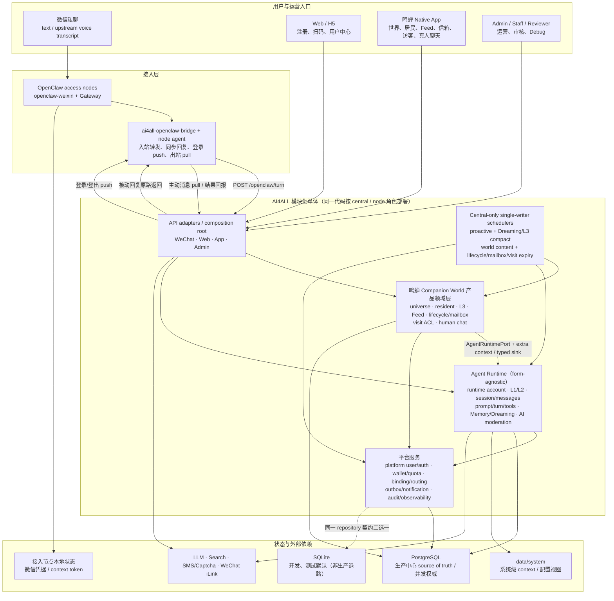

# AI4ALL 多产品服务总体架构

更新时间：2026-08-04

## 一句话理解

AI4ALL = **多渠道接入** + **产品领域层** + **形态无关 Agent Runtime** + **真人级平台服务与中心调度**。当前启用朝夕相伴（`zhaoxi`）；鸣蝉（`mingchan`）的仓库代码拆分已完成，注册表保持禁用直至验证、客户端切换和生产发布完成。

它不是 OpenClaw 的简单托管版，也不是公共客服号机器人。OpenClaw 只负责微信连接、消息收发和 hook runtime；AI4ALL Backend 以独立产品域服务朝夕的微信 1:1 Agent/Web 接入与鸣蝉 Native App，持有产品用户、世界/居民、关系运行时、记忆、权益、主动触达和运营状态。

## 文档分层

本文回答“系统整体长什么样、各层职责是什么、核心链路如何流动”。

详细落地以以下文档为准：

| 文档 | 作用 |
| --- | --- |
| `docs/products/README.md` | 产品目录、`app_id` 与产品文档 manifest |
| `docs/products/zhaoxi/prd.md` | 朝夕产品范围、需求和验收标准 |
| `docs/products/mingchan/prd.md` | 鸣蝉产品边界、拆分策略和启用门槛 |
| `docs/STATUS.md` | 项目现状、重点方向、在途工作和已知大缺口（持续更新） |
| `docs/architecture/system_design.md` | 详细技术设计、数据模型和工作包摘要（§7 工作包为 Phase 1 历史快照） |
| `docs/architecture/shared/access/identity_model_and_wechat_binding.md` | 身份模型、扫码绑定和账号路由专题 |
| `docs/architecture/products/zhaoxi/proactive_messaging_design.md` | 朝夕主动消息、提醒、commitment 和 scheduler 专题 |
| `docs/architecture/agent-runtime/agent_context_files.md` | Agent Context Files、daily notes、长期记忆和 Dreaming |
| `docs/architecture/agent-runtime/conversation_orchestrator_design.md` | 主对话 turn、Session/Messages、Intent/Tool Use、Prompt、同步回复和主动消息衔接 |
| `docs/architecture/shared/platform/entitlement_growth_design.md` | 贝壳 wallet/ledger、成本事件、邀请奖励和支付后置 |

## 1. 顶层架构



核心原则：

- **通道层薄**：OpenClaw / Bridge 只持有微信运行态，不保存 AI4ALL 长期业务状态。
- **隔离锚点显式**：真人级权益/配额锚 `platform_user_id`；世界共享状态锚 `universe_id`；每位 Agent 的 L1/L2、session/messages 锚 runtime `account_id`。任何未带正确作用域的查询都是 bug。
- **Runtime 形态无关**：Companion World 只能通过 `AgentRuntimePort` 和加性 context/memory 接缝调用 Runtime；Runtime 不反向依赖 World，真人聊天不进入 AI `messages`/prompt/Dreaming。
- **模块化单体 + 共享 PG + central scheduler 单 writer**：aliyun1/aliyun2 厚节点都会执行各自账号的 turn 并读写同一中心 PostgreSQL；DDL migration 与全局 scheduler 只由 central 执行。并发正确性依赖 PG 事务、行锁/advisory lock、唯一约束与幂等键；进入 active-active 或分片前必须先设计 lease/fencing。
- **同步链路短**：普通聊天和普通 Web Search 尽量在当前 turn 同步返回；长耗时搜索、复杂整理或后台报告请求直接返回失败/不支持说明，不创建后台任务。语音当前依赖上游转写后进入普通文本链路。
- **主动触达受控**：所有主动消息经过 outbound ledger 和类型化策略；用户提醒按用户设定时间发送，陪伴跟进和内容推送受 quiet hours、日上限和偏好约束。
- **运营可见**：账号、绑定、会话、消息、提醒/主动发送、用量、权益、错误都需要能被 Admin 追踪。
- **新产品默认关闭**：鸣蝉完成代码归属、产品作用域和客户端切换前，注册表保持禁用；代码合入或 migration 就绪不等于生产开量。产品内能力仍由正交 flag 灰度。

## 2. 核心概念分层

| 层 | 当前职责 | 依赖约束 |
| --- | --- | --- |
| 接入与产品 API | WeChat/OpenClaw、Web、Native App、Admin 的协议适配与 composition | 只做认证、DTO、路由和组合，不持有领域真相 |
| 鸣蝉 Companion World 产品领域 | universe/resident、L3、Feed/通知、lifecycle/mailbox、visit/human chat | 可调用 `AgentRuntimePort` 和平台服务；不得把 World 概念下沉 Runtime |
| Agent Runtime | runtime account、L1/L2、session/messages、prompt/turn/tool、Memory/Dreaming、AI moderation | 形态无关；不得反向 import Companion World；human chat 永不进入 AI 路径 |
| 平台服务 | platform user/auth、binding/routing、wallet/quota、DB/repository、outbox、审计观测 | 真人级共享能力锚 `platform_user_id`；为上层提供事务与基础设施 |
| 状态与基础设施 | PostgreSQL/SQLite、system context、OpenClaw 节点状态、外部 provider | 生产业务状态只进中心 PG；厚 node 可直连 PG 执行业务读写，但只有 central 执行 schema migration |

依赖方向固定为 `API adapter → product domain → AgentRuntimePort → runtime implementation`，产品域旁挂平台服务。朝夕微信链路可由产品 API 直接调用 Runtime；鸣蝉必须先经过 Companion World 解析 owner/ACL/shared context。两个产品不得相互 import。

## 3. AI4ALL Conversation Turn

普通文本消息的核心执行流程：

```text
Inbound WeChat Message
        │
        ▼
OpenClaw / Bridge
        │
        ▼
POST /openclaw/turn
        │
        ▼
┌────────────────────┐
│ Identity Resolve    │  channel_account_id / session_key -> ai4all_account_id
└─────────┬──────────┘
          ▼
┌────────────────────┐
│ Account Policy      │  disabled / rpm / daily limit / future entitlement check
└─────────┬──────────┘
          ▼
┌────────────────────┐
│ Message Dedupe      │  message_id + account boundary
└─────────┬──────────┘
          ▼
┌────────────────────┐
│ Special Cmd / Onboard │  #重置会话 / #状态；onboarding 状态子流程，其余进入普通聊天
└─────────┬──────────┘
          ▼
┌────────────────────┐
│ Context Assembly    │  recent messages + context files + memory + runtime
└─────────┬──────────┘
          ▼
┌────────────────────┐
│ Prompt + Tools      │  safety + context + enabled tool schema
└─────────┬──────────┘
          ▼
┌────────────────────┐
│ LLM / Tool Use      │  reply or web_search tool call + timeout + fallback
└─────────┬──────────┘
          ▼
┌────────────────────┐
│ Persist Reply       │  messages / usage / debug trace
└─────────┬──────────┘
          ▼
Bridge Synthetic Reply -> WeChat
          │
          ▼
After Turn: memory write / commitment extraction / metrics
```

Phase 1 的同步 turn 可以执行低延迟工具调用。普通 Web Search 按 OpenClaw 风格由模型通过 `web_search` tool use 触发并同步返回；长耗时搜索、长内容整理或复杂工具链超过同步等待体验时，当前回合返回失败或不支持说明。Phase 1 不创建用户请求后的后台任务，也不补发搜索结果。

## 4. 主动调度与发送

```text
User-triggered long search / complex background request
        │
        ▼
Failure or unsupported explanation in current turn
  “这个需要后台长时间整理，Phase 1 暂时不支持整理好后再发。”
        │
        ▼
no task / no worker / no outbound result delivery
```

主动提醒和内容推送走发送底座：

```text
reminder / commitment / 内容邀请 / reactivation 拉活 / 账号主动检查
        │
        ▼
Scheduler due scan
        │
        ▼
policy check
  category-specific policy / idempotency / cooldown
        │
        ▼
outbound_messages ledger
        │
        ▼
Gateway send + status writeback
```

区别在于：

- Scheduler / due dispatcher 只服务提醒、陪伴跟进和内容推送，不属于用户请求异步任务机制。
- 用户提醒是用户明确设定任务，严格按设定时间发送，不受主动触达总开关和默认日上限影响。
- 新闻、搞笑等内容推送是“试探性主动触达”，必须严格低频、可拒绝、可冷却。

## 5. 状态所有权

| 状态 | Source of Truth | 说明 |
| --- | --- | --- |
| 微信登录态、context token | OpenClaw / openclaw-weixin | AI4ALL 暂不复制底层通道 token |
| 平台用户和手机号 | AI4ALL Backend | `platform_users` |
| 真人级权益、配额与偏好 | AI4ALL Backend | `platform_user_id` 是 wallet、daily/RPM quota、App 通知和真人级触达的共享锚点 |
| Agent 关系运行容器 | AI4ALL Backend | 概念名 `agent_runtime_id`，当前兼容表/字段仍为 `accounts.id` / `account_id`；每位居民对应独立 runtime account |
| 通道绑定关系 | AI4ALL Backend | `channel_bindings` + raw identity |
| 会话和消息 | AI4ALL Backend | `sessions` / `messages` |
| Soul、Profile、Context Files | AI4ALL Backend | `account_profile_files` 是账号级权威存储；Markdown/文件是可读视图或 system context |
| L1 人设/使命、L2 关系状态 | AI4ALL Backend | runtime `account_id` 隔离，各 Agent 独立 |
| L3 用户沉淀记忆 | AI4ALL Backend | `universe_memory_facts` 按 `universe_id` append-only 共享；不含各居民私聊原文 |
| 世界、居民与 AI 会话 | AI4ALL Backend | `universes` / `universe_residents` / `ai_conversations`，owner ACL 以 `platform_user_id` 校验 |
| 世界内容与通知 | AI4ALL Backend | Feed/outbox 与 App notifications 分表、分入口、分红点，不复用 AI `messages` |
| 生命周期、信箱、访客与真人聊天 | AI4ALL Backend | Companion World 独立领域表与 ACL；human messages 永不进入 Agent Runtime |
| reminders / commitments / content push | AI4ALL Backend | 不放入 OpenClaw Cron 作为主状态 |
| Web Search provider trace | AI4ALL Backend | `tool_invocations` / `search_provider_runs` / `cost_events` |
| Debug trace / audit | AI4ALL Backend | 可包含 OpenClaw shadow trace |

## 6. 与 OpenClaw 的关系

AI4ALL 借鉴 OpenClaw 的“Agent OS”思想，但产品边界不同：

| 维度 | OpenClaw | AI4ALL 当前架构 |
| --- | --- | --- |
| 使用者 | 单个 owner 或开发者 | 普通 C 端用户 |
| 运行模型 | 本地一对一 agent runtime | 中心模块化单体：产品域组合多个隔离 Agent Runtime |
| 通道 | 多通道 Gateway | 微信/OpenClaw、Web、Native App 三类显式 `ChannelCapability` |
| 状态 | 实例/workspace/session 为主 | `platform_user_id` / `universe_id` / runtime `account_id` 分层锚定 |
| Prompt | 本地 agent context | runtime L1/L2 + 产品域注入的 universe L3 + 后端策略 |
| Memory | 本地 memory/Dreaming | runtime 独立记忆 + universe typed facts + 可审计 Dreaming |
| Tools | agent 可直接调用工具 | 后端按渠道、账号、权益和权限启用 |
| Cron/定时检查 | 单用户 agent 循环 | central single-writer scheduler + 账号/真人/世界级策略 |
| 运营 | 用户自管理 | Admin/Support/Entitlement/Moderation 控制面 |

OpenClaw 仍然是重要参考，尤其是 Agent Loop、context engine、tool schema、Dreaming、定时检查和 trace。但 AI4ALL 的业务状态必须留在自己的后端。

## 7. 部署形态

### 当前本地形态

```text
AI4ALL_ROLE=standalone
FastAPI Backend + Web/App/Admin routes
DATABASE_URL 为空 → SQLite；非空 → PostgreSQL
OpenClaw Gateway + ai4all-openclaw-bridge local process
single-worker 时可启用 in-process scheduler；推荐独立 scheduler 进程
```

适合开发、双后端测试和真实微信链路验证。SQLite 是 dev/test 默认档，不是生产后端或生产
回滚通道；生产故障恢复必须在 PostgreSQL 的备份、主备和恢复体系内完成。

### 当前生产形态（aliyun1 central+node + aliyun2 厚 node）

```text
Nginx / HTTPS
        │
        ▼
aliyun1 central,node                     aliyun2 node
├── Web/App/Admin 控制面                 ├── 本地 /openclaw/turn
├── 本机微信账号的 /openclaw/turn        ├── 本地 OpenClaw / node agent
├── central-only schedulers              └── 直连 aliyun1 PostgreSQL
├── 本地 OpenClaw / node agent                         │
└── PostgreSQL（生产唯一 source of truth）◀─────────────┘
```

当前拓扑不变量：

- 生产 PostgreSQL 是唯一业务 source of truth。aliyun1 和 aliyun2 都运行完整 turn 栈，分别本地
  处理归属本节点的微信账号，并直接读写同一中心 PG。
- `AI4ALL_ROLE=node` 不挂 Web/App/Admin 控制面，也不执行 `init_db()`；启动时只验证 PG 可用。
  DDL migration 只能由带 central 角色且显式通过 migration interlock 的进程执行。
- proactive/Dreaming、world content、lifecycle/mailbox/visit expiry 等 scheduler 必须指定 central 单例运行，避免重复扫描。
- reminder、outbound、Feed slot、visit/chat 等竞争路径依赖 PG 原子 claim、行锁/advisory lock、唯一约束和幂等键。
- OpenClaw 插件/Gateway 能力必须做版本固定和补丁检查；微信凭据只留在账号所属接入节点。
- Redis、消息队列、对象存储和 active-active 不是当前正确性的前提；只有出现明确扩缩容信号后再引入，且不得绕过现有状态所有权。

### 角色职责

一套代码按 `AI4ALL_ROLE` 选择能力。`central` 与 `node` 可独立部署，也可像 aliyun1 一样同机共存：

| 角色 | 跑什么 | 碰中心 DB? |
| --- | --- | --- |
| `standalone`（默认） | 本地开发的一体化 Web/App/Admin、turn 与可选 scheduler | 是；默认 SQLite，也可显式使用 PG |
| `central` | Web/App/Admin 控制面、schema migration、central-only scheduler 与节点编排 | 是；生产使用 PG |
| `node` | 归属账号的本地 turn、OpenClaw bridge、微信会话与 node agent | **是；生产直连中心 PG，但不跑 migration** |
| `central,node` | central 与 node 能力同机组合；当前 aliyun1 形态 | 是；生产本机连接中心 PG |

微信账号注册/登录时确定 `assigned_node_id`，后续由归属节点本地处理 turn；`node_id` 是路由与
调度分片属性，不代替 `account_id`、`platform_user_id` 或 `app_id` 的隔离判断。中心发起的登录/
登出操作通过 node agent push；跨节点主动消息经 durable outbound claim/pull 投递。

当前厚节点设计见 [`shared/data/thick_node_postgres_refactor.md`](shared/data/thick_node_postgres_refactor.md)，
生产差异以 [`../ops/platform/aliyun1_aliyun2_deployment_diff.md`](../ops/platform/aliyun1_aliyun2_deployment_diff.md)
为准。早期“中心大脑 + 瘦节点”只保留为演进背景，不再作为当前拓扑。

## 8. 当前架构状态与下一阶段边界

1. 朝夕微信业务继续复用既有 Agent Runtime，保持 1 真人 ↔ 1 Agent 的兼容行为；微信/Web channel 由 `ChannelCapability` 显式声明会话、投递、onboarding、proactive 和 TDAI 能力。
2. 鸣蝉 Companion World 后端闭环已归入 `app/products/mingchan/`，运行时固定使用
   `app_id=mingchan`；生产验证和 clean-start 完成前不得启用 `mingchan`。多居民、L3、Feed/通知、
   lifecycle/mailbox、visit 和 human chat 继续受 AST 分层门禁保护。
3. 真人级 wallet/quota/override 已上迁 `platform_user`；每位居民仍以独立 runtime account 持有 L1/L2、session/messages，World 只通过端口组合 Runtime。
4. 当前生产为中心 PostgreSQL + 两个厚节点本地 turn；SQLite 只承担开发与测试，竞态正确性以 PostgreSQL 测试为权威。
5. legacy Companion World 主能力、语音输入与 v1.5 媒体/许愿能力曾以朝夕配置启用；拆分期间维持现有行为，不视为鸣蝉已生产启用。客户端切换后仍必须以鸣蝉配置接口返回的能力位为准。
6. 当前模块化单体、共享 PG 与 central-only scheduler 单 writer 是明确约束。进入多地域 active-active、按世界分片或 scheduler 拆服务前，必须先设计任务所有权、lease/fencing 与跨分片锁，不能直接横向复制现有 worker。

详细数据模型和历史工作包摘要见 `docs/architecture/system_design.md`；Companion World 3.0 设计见 `docs/architecture/products/mingchan/companion_world_3_0_refactor_design.md`；拆分进度与近期队列见 `docs/STATUS.md`。
