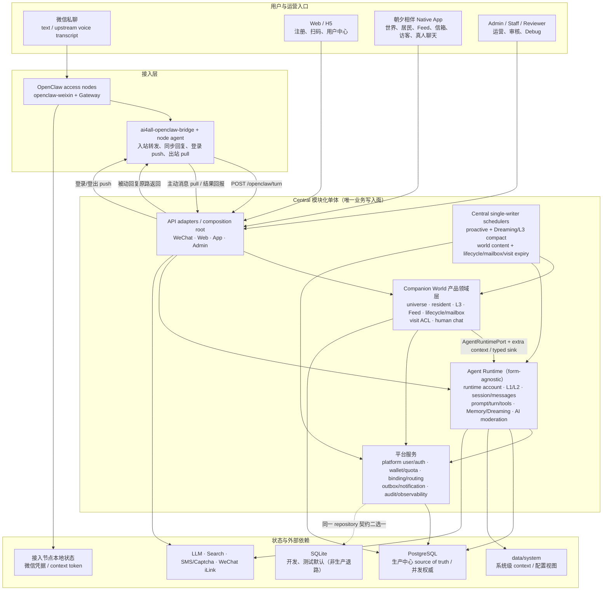

# AI4ALL 多产品服务总体架构

更新时间：2026-07-23

## 一句话理解

AI4ALL = **多渠道接入** + **产品领域层** + **形态无关 Agent Runtime** + **真人级平台服务与中心调度**。当前已启用产品是朝夕相伴；Companion World 是其产品领域，而不是所有未来产品的共享模型。

它不是 OpenClaw 的简单托管版，也不是公共客服号机器人。OpenClaw 只负责微信连接、消息收发和 hook runtime；AI4ALL Backend 同时服务微信 1:1 Agent、Web 和「朝夕相伴」Native App，持有产品用户、世界/居民、关系运行时、记忆、权益、主动触达和运营状态。

## 文档分层

本文回答“系统整体长什么样、各层职责是什么、核心链路如何流动”。

详细落地以以下文档为准：

| 文档 | 作用 |
| --- | --- |
| `docs/products/README.md` | 产品目录、`app_id` 与产品文档 manifest |
| `docs/products/zhaoxi/prd.md` | 朝夕产品范围、需求和验收标准 |
| `docs/STATUS.md` | 项目现状、重点方向、在途工作和已知大缺口（持续更新） |
| `docs/architecture/system_design.md` | 详细技术设计、数据模型和工作包摘要（§7 工作包为 Phase 1 历史快照） |
| `docs/architecture/shared/access/identity_model_and_wechat_binding.md` | 身份模型、扫码绑定和账号路由专题 |
| `docs/architecture/products/zhaoxi/proactive_messaging_design.md` | 朝夕主动消息、提醒、commitment 和 scheduler 专题 |
| `docs/architecture/agent-runtime/agent_context_files.md` | Agent Context Files、daily notes、长期记忆和 Dreaming |
| `docs/architecture/agent-runtime/conversation_orchestrator_design.md` | 主对话 turn、Session/Messages、Intent/Tool Use、Prompt、同步回复和主动消息衔接 |
| `docs/architecture/shared/platform/entitlement_growth_design.md` | 贝壳 wallet/ledger、成本事件、邀请奖励和支付后置 |

## 1. 顶层架构



核心原则：

- **通道层薄**：OpenClaw / Bridge 只持有微信运行态，不保存 AI4ALL 长期业务状态。
- **隔离锚点显式**：真人级权益/配额锚 `platform_user_id`；世界共享状态锚 `universe_id`；每位 Agent 的 L1/L2、session/messages 锚 runtime `account_id`。任何未带正确作用域的查询都是 bug。
- **Runtime 形态无关**：Companion World 只能通过 `AgentRuntimePort` 和加性 context/memory 接缝调用 Runtime；Runtime 不反向依赖 World，真人聊天不进入 AI `messages`/prompt/Dreaming。
- **模块化单体 + 中心单 writer**：当前正确性依赖中心 PostgreSQL 的事务、行锁/advisory lock/唯一约束，以及指定 central scheduler 的单 writer 纪律；进入 active-active 或分片前必须先设计 lease/fencing。
- **同步链路短**：普通聊天和普通 Web Search 尽量在当前 turn 同步返回；长耗时搜索、复杂整理或后台报告请求直接返回失败/不支持说明，不创建后台任务。语音当前依赖上游转写后进入普通文本链路。
- **主动触达受控**：所有主动消息经过 outbound ledger 和类型化策略；用户提醒按用户设定时间发送，陪伴跟进和内容推送受 quiet hours、日上限和偏好约束。
- **运营可见**：账号、绑定、会话、消息、提醒/主动发送、用量、权益、错误都需要能被 Admin 追踪。
- **新产品默认关闭**：Companion World P1/M3/M4/M5 能力均由正交 flag 灰度；代码合入或 migration 就绪不等于生产开量。

## 2. 核心概念分层

| 层 | 当前职责 | 依赖约束 |
| --- | --- | --- |
| 接入与产品 API | WeChat/OpenClaw、Web、Native App、Admin 的协议适配与 composition | 只做认证、DTO、路由和组合，不持有领域真相 |
| Companion World 产品领域 | universe/resident、L3、Feed/通知、lifecycle/mailbox、visit/human chat | 可调用 `AgentRuntimePort` 和平台服务；不得把 World 概念下沉 Runtime |
| Agent Runtime | runtime account、L1/L2、session/messages、prompt/turn/tool、Memory/Dreaming、AI moderation | 形态无关；不得反向 import Companion World；human chat 永不进入 AI 路径 |
| 平台服务 | platform user/auth、binding/routing、wallet/quota、DB/repository、outbox、审计观测 | 真人级共享能力锚 `platform_user_id`；为上层提供事务与基础设施 |
| 状态与基础设施 | PostgreSQL/SQLite、system context、OpenClaw 节点状态、外部 provider | 中心业务状态只进 AI4ALL DB；节点永不直连中心 DB |

依赖方向固定为 `API adapter → product domain → AgentRuntimePort → runtime implementation`，产品域旁挂平台服务。形态 A（微信）可由 API 直接调用 Runtime；形态 B（朝夕相伴）必须先经过 Companion World 解析 owner/ACL/shared context。

## 3. AI4ALL Conversation Turn

普通文本消息的核心执行流程：

```text
Inbound WeChat Message
        │
        ▼
OpenClaw / Bridge
        │
        ▼
POST /openclaw/turn
        │
        ▼
┌────────────────────┐
│ Identity Resolve    │  channel_account_id / session_key -> ai4all_account_id
└─────────┬──────────┘
          ▼
┌────────────────────┐
│ Account Policy      │  disabled / rpm / daily limit / future entitlement check
└─────────┬──────────┘
          ▼
┌────────────────────┐
│ Message Dedupe      │  message_id + account boundary
└─────────┬──────────┘
          ▼
┌────────────────────┐
│ Special Cmd / Onboard │  #重置会话 / #状态；onboarding 状态子流程，其余进入普通聊天
└─────────┬──────────┘
          ▼
┌────────────────────┐
│ Context Assembly    │  recent messages + context files + memory + runtime
└─────────┬──────────┘
          ▼
┌────────────────────┐
│ Prompt + Tools      │  safety + context + enabled tool schema
└─────────┬──────────┘
          ▼
┌────────────────────┐
│ LLM / Tool Use      │  reply or web_search tool call + timeout + fallback
└─────────┬──────────┘
          ▼
┌────────────────────┐
│ Persist Reply       │  messages / usage / debug trace
└─────────┬──────────┘
          ▼
Bridge Synthetic Reply -> WeChat
          │
          ▼
After Turn: memory write / commitment extraction / metrics
```

Phase 1 的同步 turn 可以执行低延迟工具调用。普通 Web Search 按 OpenClaw 风格由模型通过 `web_search` tool use 触发并同步返回；长耗时搜索、长内容整理或复杂工具链超过同步等待体验时，当前回合返回失败或不支持说明。Phase 1 不创建用户请求后的后台任务，也不补发搜索结果。

## 4. 主动调度与发送

```text
User-triggered long search / complex background request
        │
        ▼
Failure or unsupported explanation in current turn
  “这个需要后台长时间整理，Phase 1 暂时不支持整理好后再发。”
        │
        ▼
no task / no worker / no outbound result delivery
```

主动提醒和内容推送走发送底座：

```text
reminder / commitment / 内容邀请 / reactivation 拉活 / 账号主动检查
        │
        ▼
Scheduler due scan
        │
        ▼
policy check
  category-specific policy / idempotency / cooldown
        │
        ▼
outbound_messages ledger
        │
        ▼
Gateway send + status writeback
```

区别在于：

- Scheduler / due dispatcher 只服务提醒、陪伴跟进和内容推送，不属于用户请求异步任务机制。
- 用户提醒是用户明确设定任务，严格按设定时间发送，不受主动触达总开关和默认日上限影响。
- 新闻、搞笑等内容推送是“试探性主动触达”，必须严格低频、可拒绝、可冷却。

## 5. 状态所有权

| 状态 | Source of Truth | 说明 |
| --- | --- | --- |
| 微信登录态、context token | OpenClaw / openclaw-weixin | AI4ALL 暂不复制底层通道 token |
| 平台用户和手机号 | AI4ALL Backend | `platform_users` |
| 真人级权益、配额与偏好 | AI4ALL Backend | `platform_user_id` 是 wallet、daily/RPM quota、App 通知和真人级触达的共享锚点 |
| Agent 关系运行容器 | AI4ALL Backend | 概念名 `agent_runtime_id`，当前兼容表/字段仍为 `accounts.id` / `account_id`；每位居民对应独立 runtime account |
| 通道绑定关系 | AI4ALL Backend | `channel_bindings` + raw identity |
| 会话和消息 | AI4ALL Backend | `sessions` / `messages` |
| Soul、Profile、Context Files | AI4ALL Backend | `account_profile_files` 是账号级权威存储；Markdown/文件是可读视图或 system context |
| L1 人设/使命、L2 关系状态 | AI4ALL Backend | runtime `account_id` 隔离，各 Agent 独立 |
| L3 用户沉淀记忆 | AI4ALL Backend | `universe_memory_facts` 按 `universe_id` append-only 共享；不含各居民私聊原文 |
| 世界、居民与 AI 会话 | AI4ALL Backend | `universes` / `universe_residents` / `ai_conversations`，owner ACL 以 `platform_user_id` 校验 |
| 世界内容与通知 | AI4ALL Backend | Feed/outbox 与 App notifications 分表、分入口、分红点，不复用 AI `messages` |
| 生命周期、信箱、访客与真人聊天 | AI4ALL Backend | Companion World 独立领域表与 ACL；human messages 永不进入 Agent Runtime |
| reminders / commitments / content push | AI4ALL Backend | 不放入 OpenClaw Cron 作为主状态 |
| Web Search provider trace | AI4ALL Backend | `tool_invocations` / `search_provider_runs` / `cost_events` |
| Debug trace / audit | AI4ALL Backend | 可包含 OpenClaw shadow trace |

## 6. 与 OpenClaw 的关系

AI4ALL 借鉴 OpenClaw 的“Agent OS”思想，但产品边界不同：

| 维度 | OpenClaw | AI4ALL 当前架构 |
| --- | --- | --- |
| 使用者 | 单个 owner 或开发者 | 普通 C 端用户 |
| 运行模型 | 本地一对一 agent runtime | 中心模块化单体：产品域组合多个隔离 Agent Runtime |
| 通道 | 多通道 Gateway | 微信/OpenClaw、Web、Native App 三类显式 `ChannelCapability` |
| 状态 | 实例/workspace/session 为主 | `platform_user_id` / `universe_id` / runtime `account_id` 分层锚定 |
| Prompt | 本地 agent context | runtime L1/L2 + 产品域注入的 universe L3 + 后端策略 |
| Memory | 本地 memory/Dreaming | runtime 独立记忆 + universe typed facts + 可审计 Dreaming |
| Tools | agent 可直接调用工具 | 后端按渠道、账号、权益和权限启用 |
| Cron/定时检查 | 单用户 agent 循环 | central single-writer scheduler + 账号/真人/世界级策略 |
| 运营 | 用户自管理 | Admin/Support/Entitlement/Moderation 控制面 |

OpenClaw 仍然是重要参考，尤其是 Agent Loop、context engine、tool schema、Dreaming、定时检查和 trace。但 AI4ALL 的业务状态必须留在自己的后端。

## 7. 部署形态

### 当前本地形态

```text
AI4ALL_ROLE=standalone
FastAPI Backend + Web/App/Admin routes
DATABASE_URL 为空 → SQLite；非空 → PostgreSQL
OpenClaw Gateway + ai4all-openclaw-bridge local process
single-worker 时可启用 in-process scheduler；推荐独立 scheduler 进程
```

适合开发、双后端测试和真实微信链路验证。SQLite 是 dev/test 默认与生产回滚通道，属于刻意保留的受支持路径；它不是当前生产主后端。

### 当前生产形态（aliyun1 中心 + aliyun1/aliyun2 接入）

```text
Nginx / HTTPS
        │
        ▼
aliyun1 Central FastAPI + central schedulers
        │
        ├── PostgreSQL（唯一业务写入库）
        ├── aliyun1 OpenClaw / node agent
        └── aliyun2 OpenClaw / node agent（HTTP 接入中心，不直连 DB）
```

当前拓扑不变量：

- 中心 FastAPI 是业务读写入口，生产 PostgreSQL 是唯一业务 source of truth；接入节点永不直连 DB。
- proactive/Dreaming、world content、lifecycle/mailbox/visit expiry 等 scheduler 必须指定 central 单例运行，避免重复扫描。
- reminder、outbound、Feed slot、visit/chat 等竞争路径依赖 PG 原子 claim、行锁/advisory lock、唯一约束和幂等键。
- OpenClaw 插件/Gateway 能力必须做版本固定和补丁检查；微信凭据只留在账号所属接入节点。
- Redis、消息队列、对象存储和 active-active 不是当前正确性的前提；只有出现明确扩缩容信号后再引入，且不得绕过现有状态所有权。

### 多机接入形态（中心大脑 + 瘦接入节点）

为突破「单一出口 IP 挂大量微信号」触发风控的瓶颈，接入层可横向扩展到多机。一套代码按 `AI4ALL_ROLE` 选能力，**central（中心大脑）与 node（瘦接入节点）可独立、也可同机共存**：

| 角色 | 跑什么 | 碰中心 DB? |
| --- | --- | --- |
| `standalone`（默认） | = 今天单机形态，全部 + openclaw 本机直发 | 是（本机） |
| `central` | FastAPI 大脑、中心 DB（唯一写者）、画像、三调度器、审核台、admin、节点面向 API | 是（本机） |
| `node` | openclaw + 微信会话、节点 agent（入站转发 + 出站轮询 + 登录 exec） | **否，一律走 HTTP 与中心通信** |

生产落地（aliyun1+aliyun2 双机 MVP）：

```text
                         微信用户
        ┌───────────────────┴───────────────────┐
┌───────┴────────┐                      ┌────────┴────────────┐
│ aliyun2 (node) │                      │ aliyun1             │
│ openclaw+会话   │                      │ central + node 同机  │
│ node-agent     │  ① 入站转发(HTTP→中心) │ openclaw+会话         │
│                │  ② 登录 push(中心拨节点)│ FastAPI 大脑 + 调度   │
│                │  ③ 出站 pull 认领       │ PostgreSQL(唯一写者)  │
└────────────────┘  ④ 结果回报            └─────────────────────┘
```

> **中心存储后端**：2026-06-21 起 aliyun1 中心库由 SQLite 切换为本机 **PostgreSQL**（厚节点改造 P1，见 [`shared/data/thick_node_postgres_refactor.md`](shared/data/thick_node_postgres_refactor.md) 与切换记忆 [[pg-migration-cutover-state]]）。**这对节点与拓扑完全透明**：节点本就永不直连 DB，无论中心是 SQLite 还是 PG，节点只经 HTTP `/openclaw/turn`、`/node/*` 与中心通信，路由/归属/账号隔离逻辑一字未改。

- **不变量**：只有 central 进程读写中心库（现为 aliyun1 本机 PostgreSQL，仅监听 localhost）；节点永不直连 DB。`node_id` 只是路由属性，不参与账号隔离判定。
- **核心业务在哪台机器处理（重要）**：**openclaw 通道层固定**——账号注册/登录时定在 aliyun1 或 aliyun2 的 openclaw 上，此后不迁移、不切换。但通道之后的**全部核心业务（turn 处理：prompt 组装、LLM、记忆、计费、DB 读写）一律在 aliyun1 中心进程执行**。因此**归属 aliyun2 的微信用户，其每条消息都会被转发到 aliyun1 后端处理**（见下「入站」）。这一集中式形态自 2026-06-14 多机上线即如此，**PG 切换没有改变它**——PG 只是把 aliyun1 中心进程的存储从 SQLite 换成了 PG。aliyun2 上没有 turn 处理后端（node-agent 仅暴露 `exec/*`+`outbound/claim`+`heartbeat`+`health`，无 `/openclaw/turn`）。
- **入站**：节点 openclaw 把 `/openclaw/turn` POST 到中心（aliyun2 的 bridge 插件 `AI4ALL_BACKEND_URL=http://aliyun1`）；**被动回复内联在 HTTP 响应里原路返回**由本节点 openclaw 发出，零跨机。
- **出站混合**：登录/登出/扫码走 **push**（中心按 `access_nodes.base_url` 直拨目标节点 agent，二维码低延迟同步回传）；主动消息走 **pull**（节点轮询 `/node/outbound/claim` 认领，复用 `outbound_messages` 抢占式 claim，节点掉线消息留队列可续传）。
- **节点 → 中心**走「稳定指纹地址」`CENTRAL_URL`（MVP=内网 hosts 别名），切换中心只改该指向，节点零改配。
- **中心可切换 aliyun1↔aliyun2**：中心状态 = 中心库（现为 PostgreSQL，含 `account_profile_files` 画像表，P2 起画像已入库）+ system 目录；切换需迁移 PG 数据（`scripts/migrate_sqlite_to_pg.py` 同类思路）+ rsync system 目录；切换后原中心机降为 node，**微信会话不重扫码**。一键化/热备留二期。

`standalone` 等价于「central+node 同机 + 出站本机即时直发」，保证本地开发与现有测试零回归。详细落地、迁移 Runbook 与切换流程见 [`docs/architecture/shared/access/multi_node_access_refactor.md`](shared/access/multi_node_access_refactor.md)。

## 8. 当前架构状态与下一阶段边界

1. 微信形态 A 继续复用既有 Agent Runtime，保持 1 真人 ↔ 1 Agent 的兼容行为；Web/native channel 由 `ChannelCapability` 显式声明会话、投递、onboarding、proactive 和 TDAI 能力。
2. Companion World 形态 B 的 M2–M5 后端闭环已合入主干：多居民、L3、Feed/通知、lifecycle/mailbox、visit 和 human chat 均已实现并由 AST 分层门禁保护。
3. 真人级 wallet/quota/override 已上迁 `platform_user`；每位居民仍以独立 runtime account 持有 L1/L2、session/messages，World 只通过端口组合 Runtime。
4. 当前生产为中心 PostgreSQL + 多 OpenClaw 接入节点；SQLite 继续承担开发、测试和回滚。竞态正确性以 PostgreSQL 测试为权威。
5. Companion World P1/M3/M4/M5 flag 仍默认关闭。代码就绪不代表生产已迁移或开量；客户端口径、模板/backfill、钱包与 override 对账、evidence retention 和只读发布核验仍是开旗门槛。
6. 当前模块化单体与 central single-writer 拓扑是明确约束。进入多地域 active-active、按世界分片或 scheduler 拆服务前，必须先设计任务所有权、lease/fencing 与跨分片锁，不能直接横向复制现有 worker。

详细数据模型和历史工作包摘要见 `docs/architecture/system_design.md`；3.0 冻结决策与代码地图见 `docs/architecture/products/zhaoxi/companion_world_3_0_refactor_design.md`；当前实现缺口与近期队列见 `docs/STATUS.md`。
