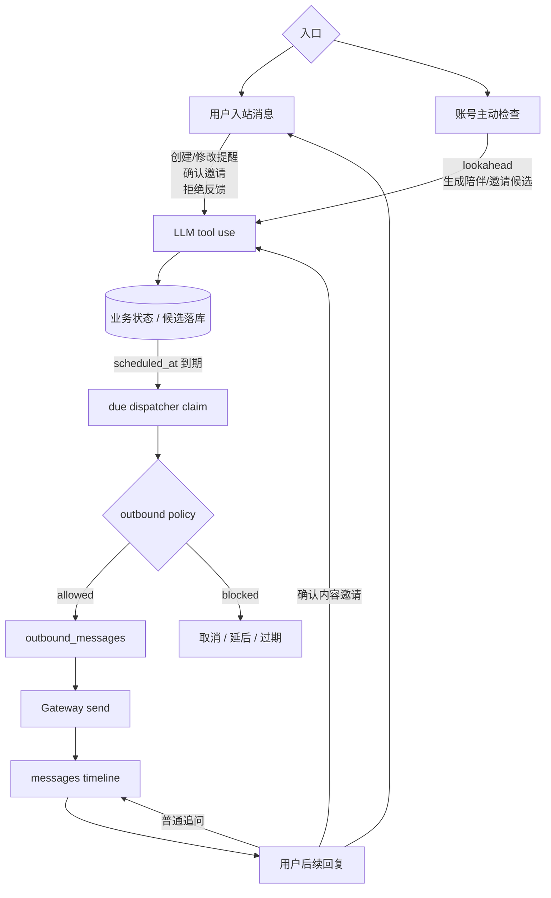
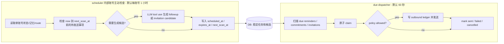
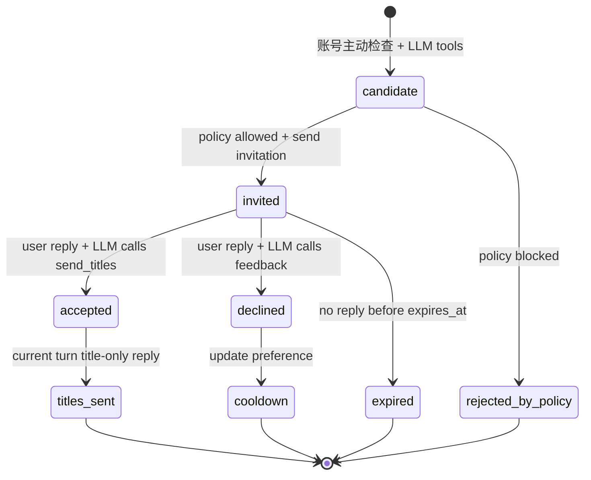

# 主动消息与提醒技术设计

更新时间：2026-06-02

本文承接 [主动消息与提醒 PRD](../product/proactive_prd.md)，定义 Phase 1 主动消息、用户提醒、陪伴跟进和内容邀请的技术边界。后续 `app.proactive.*`、LLM tool use、scheduler、outbound ledger 和 OpenClaw Gateway send 相关开发以本文为准。

## 1. 设计目标

Phase 1 的目标不是做一个高频推送系统，而是在个人微信号场景下提供低风险、可审计、可恢复的主动触达基础能力：

- 用户提醒：用户明确设置的一次性或周期性提醒，按用户设定时间发送。
- 陪伴跟进：基于聊天历史、hidden commitment 或关系上下文的低频关怀。
- 内容邀请：发现用户可能感兴趣的内容后，先以朋友式话术询问；用户正向确认后才发送标题列表。

正式决策：Phase 1 不支持用户请求后的后台整理、异步任务补发或长耗时报告生成。Scheduler / due dispatcher 只用于提醒、陪伴跟进和内容邀请调度，不属于用户请求异步任务机制。

## 2. 产品不变量

以下规则是技术实现必须保持的产品不变量：

| 类型 | 触发来源 | 总开关 | Quiet hours | 默认日上限 | 6 小时避让 | 费用 |
| --- | --- | --- | --- | --- | --- | --- |
| 用户提醒 | 用户明确设置 | 不受影响 | 严格按用户设定时间发送 | 不设上限 | 不被低优先级反向压制 | 提醒投递首条不扣用户贝壳 |
| 陪伴跟进 | hidden commitment、账号主动检查、历史话题 | 受影响 | 受影响，默认 22:00 到次日 7:00 | 默认 1 条 | 避让用户提醒 | 首条不扣用户贝壳 |
| 内容邀请 | 内容策略、垂类源、运营配置、用户关注点 | 受影响 | 受影响，默认 22:00 到次日 7:00 | 默认 1 条主动邀请 | 避让用户提醒和陪伴跟进 | 主动邀请首条不扣用户贝壳 |

补充规则：

- 所有 outbound 都必须写入 `outbound_messages`，保留幂等键、策略结果、发送状态、Gateway message id 和错误信息。
- 用户收到主动触达后继续回复，后续 AI 回复或搜索按普通聊天或工具调用规则扣减贝壳。
- 陪伴跟进和内容邀请不设置合计日上限或周上限，但各自默认每日最多 1 条。
- 内容邀请只能发送朋友式询问，不能直接发送内容列表、链接、长摘要或完整日报。
- 用户确认后的标题列表属于用户触发后的普通入站回合回复，不占内容邀请主动日上限。
- 用户明确拒绝某类内容后，Phase 1 至少 1 个月不再邀请该类别，1 个月后重新试探策略只记录，不实施。

## 3. 整体流程

主动消息体系由两条入口组成：

- 入站入口：用户发消息后，LLM 通过 tool use 创建、更新、取消或确认某个业务状态。
- 调度入口：scheduler 周期扫描已持久化的任务、候选和账号状态，到点后通过 outbound ledger 主动投递。

两条入口都必须落到同一套账号隔离、policy、ledger、message timeline 和 trace 上，不能各自实现一套发送逻辑。

### 3.1 主动消息生命周期



这张图只表达一个核心：**主动消息不是直接从 LLM 发出去，而是先变成可审计、可 claim、可取消的业务状态**。

- 入站消息和账号主动检查都只能通过 LLM tool use 创建或推进业务状态。
- due dispatcher 只处理已经持久化且到期的状态，不临时让 LLM 现场决定要不要发。
- policy 决定是否允许主动发送；被拦截的消息必须有状态和 reason。
- 成功发送后才进入 messages timeline，成为后续对话上下文。

### 3.2 Scheduler 与账号主动检查



这张图表达两个循环的职责差异：

- 账号主动检查是 scheduler 的一个阶段，负责“看未来一小时、想清楚、写候选”，不作为独立机制存在，也不负责提前发送。
- due dispatcher 负责“到点 claim、过 policy、发出去、回写状态”，不负责临时生成候选。
- 两者只通过 DB 协作；这是避免重启丢任务和多实例重复发送的关键。

### 3.3 内容邀请二阶段流程



内容邀请最容易误实现成“定时发新闻列表”，所以这里单独强调：

- `invited` 只是一句朋友式询问，不带标题、链接或摘要。
- 用户是否确认由 LLM 调用工具判断，后端不靠“嗯”或 emoji 规则触发。
- `titles_sent` 是用户确认后的当前回合回复，不是 scheduler 主动补发。

### 3.4 典型端到端流程

用户设置提醒：

```text
用户消息
-> LLM 调用 create_reminder
-> 写 reminders
-> 到点 due dispatcher claim
-> user_reminder policy
-> outbound ledger
-> Gateway send
-> messages timeline
```

陪伴跟进：

```text
普通聊天成功回复
-> hidden commitment / 账号主动检查生成候选
-> 写 proactive_commitments 或 account_check_candidate
-> 账号主动检查做 lookahead 和避让
-> 到点 due dispatcher claim
-> companion_followup policy
-> outbound ledger
-> Gateway send
-> messages timeline
```

内容邀请：

```text
账号主动检查
-> LLM 可调用 web_search 和 create_content_invitation_candidate
-> 写 content_invitations(candidate)
-> policy 允许后发送 invitation
-> 用户回复
-> LLM 调用 send_content_invitation_titles 或 record_content_invitation_feedback
-> 当前回合返回标题列表或写入拒绝冷却
```

## 4. OpenClaw 借鉴与 AI4ALL 差异

OpenClaw 的定时 loop、cron 和 channel send 证明了 agent 产品需要具备定时任务、主动发送、任务恢复和上下文感知能力。AI4ALL 应借鉴这些设计，但不能照搬运行边界：

- OpenClaw 更接近一对一个人 agent；AI4ALL 是一对多服务，所有主动判断必须按 `ai4all_account_id` 隔离。
- OpenClaw Gateway 当前作为微信通道适配层；用户提醒、候选、策略、权益和审计的 source of truth 在 AI4ALL Backend。
- OpenClaw Cron 可以作为参考或 POC 工具，但 Phase 1 生产提醒应落在 AI4ALL 自己的 DB 和 scheduler。
- OpenClaw 中定时自检的作用在 AI4ALL 中由 `ProactiveScheduler` 承担；账号主动检查是 scheduler 的内部阶段，不再作为独立机制存在。

## 5. 当前代码基线

当前已有可复用基础：

- `app.openclaw_gateway.send_weixin_text()` 已封装 OpenClaw Gateway `send`。
- 已验证主动发送目标应使用 `channel_bindings.chat_id`，OpenClaw 通道账号应使用 `channel_bindings.channel_account_id`。
- `outbound_messages` 已有 `pending -> sending -> sent / failed / cancelled` 生命周期。
- `reminders` 已支持 one-shot reminder 的创建、due scan、claim、发送和状态回写。
- `app.tools` 已有 reminder tools，Web Search 已按 LLM tool use 接入。
- 提醒意图已全部由 LLM tool use 落地(`app/tools/reminder_handlers.py`:create/list/cancel/update),**不存在** `app/reminder_parser.py` / `parse_explicit_reminder()` 这一规则解析路径(该规则路径最终未采用)。
- `app.proactive.scheduler.ProactiveScheduler` 已按 due reminder、reactivation 拉活、due commitment、account check、内容邀请的顺序运行。
- `proactive_account_state` 已作为账号主动检查/commitment 的账号级 cheap pre-filter。
- `proactive_commitments` 已支持 hidden commitment 抽取、存储、due dispatch、Admin 查看和取消。
- `account_check_candidate_draft -> promote -> account_check_candidate -> send` 已形成人工确认链路。

第一轮已完成：

- `app.proactive.policy` 已提供类型化 outbound policy，`source` 映射到 `product_category`。
- 用户提醒归类为 `user_reminder`，不受主动触达总开关、quiet hours、陪伴跟进/内容邀请日上限影响；仍保留 route、ledger、幂等和 Gateway 失败记录。
- 陪伴跟进和内容邀请已分别使用分类日上限，`commitment` / `account_check` 归入 `companion_followup`。
- 6 小时避让已有第一版：陪伴跟进避让用户提醒，内容邀请避让用户提醒和陪伴跟进。
- scheduler 已按 due reminder、due commitment、账号主动检查、内容邀请过期、due content invitation 的顺序运行。
- standalone heartbeat 机制已移除；账号主动检查是 `ProactiveScheduler` 的内部阶段。
- reactivation 拉活已落地为一等子系统(`app/proactive/reactivation.py`):两类候选 `reactivation_topic_followup` / `reactivation_content_invitation`、独立 config(`reactivation_dispatch_enabled`、`reactivation_send_slots`、`reactivation_daily_limit`、`reactivation_dedupe_days` 等,见 `app/config.py`)、scheduler 阶段和用户级开关分类。
- 内容邀请已具备候选生成、朋友式邀请发送、用户确认后标题列表回复、拒绝反馈/冷却和 Debug 展示。
- Proactive Debug 后台已支持手动触发 scheduler、单账号 proactive check、account check draft 和内容邀请生成检查。

当前剩余缺口：

- 周期性提醒**基础版已实现**(`recur_rule` = `daily` / `weekly:N` / `monthly:N`,最小 1 天周期;见 `app/reminder_utils.py`、`app/tools/reminder_handlers.py`、`app/proactive/reminders.py`)。仍未实现:§10.2 的富 `recurrence_rule_json` 模型、自然语言取消/更新提醒二次确认、用户级 timezone。
- 生产多实例 scheduler lease / leader election 尚未实现；正式多实例部署前必须补齐。
- 内容邀请和陪伴跟进仍需更多真实聊天数据验证。当前测试账号上下文稀疏或话题跳跃时，LLM 保守返回 `skip_content_invitation` / `llm_no_content_invitation` 是预期行为。
- Gateway 重启、长时间无入站后的 route/context token、真实微信端到端长期稳定性仍需观察。
- 提醒意图仍有高确定性规则解析兼容路径；后续应继续迁移到 LLM tool use，但不应在第一轮收口时新增关键词/正则 intent gate。

## 6. LLM Tool-use 统一原则

提醒、搜索、内容邀请和用户确认都应采用同一类交互范式：

```text
user / scheduler context
-> build prompt + available tool schema
-> LLM decides whether to call a tool
-> backend validates tool args, account scope, policy and state
-> backend executes side effect
-> tool result returns to LLM or scheduler
-> final reply / outbound delivery
```

核心原则：

- 不用关键词、正则、字符串匹配作为用户意图主路径。
- 不在 `turn_service` 中新增“如果包含 新闻/日报/嗯 就触发某动作”的规则分支。
- LLM 只能通过明确 tool call 产生副作用，例如创建提醒、更新提醒、创建内容邀请、确认内容邀请、记录拒绝。
- 后端只做确定性校验：账号隔离、参数合法性、权限、状态机、频控、quiet hours、避让、幂等、内容安全和审计。
- 状态机守卫不是意图识别。例如“只有存在 pending invitation 才允许发送标题列表”是后端校验；判断用户这句“嗯”是否代表确认，应由 LLM 基于上下文调用工具完成。
- 模糊、矛盾或低置信用户表达不应由后端猜测。LLM 应自然追问或继续普通聊天，不调用有副作用工具。
- 所有 tool invocation 都应记录 `tool_invocations` 或等价 trace，包含 args、result/error、latency、account_id、session_id、message_id 和 tool_call_id。

### 6.1 工具注册

`app.tools` 应保持组合式工具注册：

```text
get_reminder_tools()
get_web_search_tools()
get_content_invitation_tools()
get_default_tools() = enabled tools by account/config/context
```

工具注入规则：

- Onboarding、绑定未完成、账号不可用时，不注入会产生业务副作用的工具。
- 普通聊天回合注入 reminder tools、web_search tools 和必要的 content invitation response tools。
- 只有当当前账号存在 `invited` 状态的内容邀请时，才向模型注入或提示可用的 `send_content_invitation_titles` / `record_content_invitation_feedback` 上下文。
- 后台内容邀请生成任务使用独立 prompt 和独立工具集合，不复用普通聊天人格 prompt。

### 6.2 允许的确定性规则边界

以下逻辑允许在后端确定性执行：

- tool schema 参数校验，例如时间格式、条数范围、topic 非空。
- 业务状态校验，例如 reminder 是否属于当前 account，content invitation 是否仍处于 `invited`。
- 策略校验，例如 quiet hours、每日上限、6 小时避让、冷却期和 route 是否存在。
- 安全和格式约束，例如标题列表不包含 URL、不包含长摘要、不超过条数上限。

以下逻辑不应由后端规则承担：

- 判断一句用户消息是否在创建提醒、修改提醒、确认内容邀请或拒绝内容邀请。
- 通过关键词推断 topic 或用户关注点。
- 通过 emoji 白名单直接触发标题列表发送。
- 基于“新闻/日报/推送”等词硬创建内容邀请或订阅。

## 7. 目标分类模型

技术侧保留更细的 `source`，但必须映射到产品分类：

| source | product_category | 说明 |
| --- | --- | --- |
| `reminder` | `user_reminder` | 用户设置的一次性或周期性提醒 |
| `reminder_change_confirmation` | `user_reminder` | 取消/更新提醒的确认回复，通常走入站同步回复，不一定进入 outbound |
| `commitment` | `companion_followup` | 从聊天中隐藏抽取的后续跟进 |
| `account_check` | `companion_followup` | 低频主动关怀或历史话题跟进 |
| `content_invitation` | `content_invitation` | 主动发出的朋友式内容邀请，只询问是否想看 |
| `content_invitation_titles` | `content_invitation_response` | 用户正向确认后的标题列表，属于用户触发的普通回合回复 |
| `content_invitation_feedback` | `content_invitation_response` | 用户拒绝、退订或反馈某类内容 |

建议新增常量或枚举：

```text
OutboundCategory.USER_REMINDER
OutboundCategory.COMPANION_FOLLOWUP
OutboundCategory.CONTENT_INVITATION
OutboundCategory.CONTENT_INVITATION_RESPONSE
```

`outbound_messages.source` 继续记录具体来源，新增或在 metadata 中稳定记录 `product_category`、`policy_version`、`policy_decision` 和 `policy_reason`。

## 8. Outbound Policy Engine

应将当前散落在 `enqueue_proactive_text()`、`decide_account_check_action()` 和 scheduler 调用参数里的策略，收敛为一个类型化 policy engine。

目标接口：

```python
evaluate_outbound_policy(
    account_id: str,
    category: OutboundCategory,
    source: str,
    scheduled_at: datetime | None,
    now: datetime,
    metadata: dict,
) -> PolicyDecision
```

PolicyDecision 至少包含：

```text
allowed: bool
status: pending | cancelled
reason: string | None
quota_date: string
counts: dict
next_allowed_at: string | None
metadata: dict
```

通用检查：

- 账号存在且 active。
- 有可用 channel route：`channel`、`channel_account_id`、`to_user_id`、`session_key`。
- 幂等键稳定，重试不重复发送。
- outbound ledger 写入失败时，不调用 Gateway。
- Gateway 发送失败时，写入 `failed`，保留错误原因和重试所需字段。

分类策略：

| category | 策略 |
| --- | --- |
| `user_reminder` | 不检查主动触达总开关；不检查 quiet hours；不占陪伴跟进/内容邀请日上限；仍写 ledger、route、幂等和失败状态 |
| `companion_followup` | 检查主动触达总开关、quiet hours、账号 cooldown、分类日上限 1、6 小时内是否有用户提醒 |
| `content_invitation` | 检查主动触达总开关、quiet hours、账号 cooldown、分类日上限 1、6 小时内是否有用户提醒或陪伴跟进、内容拒绝冷却；只允许邀请文本，不允许标题列表或链接 |
| `content_invitation_response` | 用户入站确认后的普通回合响应；不检查主动触达总开关，不占主动日上限；必须校验存在有效 `invited` invitation，且输出只含标题 |

Admin 手动 `bypass_quiet_hours` 只能作为排障参数进入 metadata，不能成为生产策略绕过用户提醒规则的主要机制。用户提醒本身应天然不受 quiet hours 影响。

## 9. 6 小时避让

避让只约束陪伴跟进和内容邀请，不约束用户提醒，也不约束用户确认后的标题列表回复。

调度候选阶段：

1. 生成陪伴跟进候选前，查询未来 6 小时是否已有 pending/sending/scheduled 用户提醒。
2. 生成内容邀请候选前，查询未来 6 小时是否已有用户提醒或陪伴跟进。
3. 如果被更高优先级压制，记录 `policy_reason=avoidance_window`，候选延后或丢弃。

实际发送阶段：

1. `companion_followup` 发送前再次查询 `now..now+6h` 的用户提醒。
2. `content_invitation` 发送前再次查询 `now..now+6h` 的用户提醒和陪伴跟进。
3. 如果发送前发现更高优先级消息，低优先级 outbound 应进入 `cancelled` 或 `deferred`。Phase 1 如果暂不新增 `deferred` 状态，可以取消并让候选生成器下次重新判断。

建议查询口径：

- 用户提醒来源：`reminders.status in ('pending', 'sending')` 且 `due_at` 在窗口内。
- 陪伴跟进来源：`proactive_commitments.status in ('pending', 'sending')`、active `account_check_candidate`、以及 `outbound_messages` 中同日 pending/sending/sent 的 `companion_followup`。
- 内容邀请来源：`content_invitations` 或 `outbound_messages`。

## 10. 用户提醒

### 10.1 一次性提醒

目标实现应通过 LLM tool use 创建提醒：

```text
user message
-> build prompt + reminder tool schema
-> LLM decides tool_call: create_reminder
-> backend validates account_id, due_at, text and timezone
-> create reminders row
-> tool result returns reminder summary
-> LLM replies with confirmation
-> scheduler claim due reminder
-> outbound user_reminder delivery
```

当前实现：

- 高确定性显式提醒解析仍作为兼容路径保留，但不应继续扩展规则。
- 用户提醒发送已归类为 `user_reminder`，不再因为主动触达 quiet hours 或陪伴/内容邀请日上限被取消。
- 用户提醒失败只应来自 route 缺失、Gateway 失败、用户取消、幂等冲突等原因。

后续补齐：

- 提醒创建、更新、取消、列出应继续迁移到 LLM tool use，最终让 reminder tools 成为提醒副作用的主入口。
- 自然语言取消/更新提醒需要二次确认，不应靠关键词直接执行。

### 10.2 周期性提醒

目标数据模型可以在现有 `reminders` 上扩展，也可以新增 `recurrence` 相关表。Phase 1 推荐在 `reminders` 中扩展以下字段：

```text
reminder_type: one_shot | recurring
recurrence_rule_json
next_due_at
timezone
last_sent_at
parent_reminder_id
```

`recurrence_rule_json` 最少支持：

```json
{
  "freq": "daily|weekly|monthly",
  "interval": 1,
  "by_weekday": ["SA"],
  "by_monthday": [15],
  "time": "10:00"
}
```

技术规则：

- 最小周期为 1 天，小于 1 天的规则直接拒绝。
- 用户只给周期没有具体时点时，LLM 可通过 `create_reminder` tool args 给出合理默认时点，并在最终回复中展示；不通过后端规则猜测。
- 周期提醒到期发送成功后，计算下一次 `next_due_at`，状态回到 `pending`。
- 如果某次发送失败，保留失败次数和下一次重试/补偿策略，不能直接丢失整个周期任务。

### 10.3 自然语言取消/更新

取消和更新必须二次确认。

建议新增 `reminder_change_requests`：

```text
id
account_id
target_reminder_id
change_type: cancel | update
proposed_patch_json
status: pending_confirmation | applied | rejected | expired
source_message_id
created_at
expires_at
confirmed_at
```

流程：

1. LLM 基于当前对话和 `list_reminders` 结果决定是否调用 `propose_reminder_change` 或 `update_reminder` / `cancel_reminder`。
2. 后端检索并校验候选 reminders；无法唯一匹配时 tool 返回 `needs_clarification`，由 LLM 追问。
3. 对需要二次确认的取消/更新，后端生成 `reminder_change_requests.pending_confirmation`。
4. 同步回复拟调整结果，等待用户确认。
5. 后续用户消息进入 tool-enabled LLM；模型确认用户同意后调用 apply 工具，否则保持原提醒不变。

确认期内，普通聊天主链路向 LLM 提供 pending change request 上下文和确认工具。是否把“确认”“好的”理解为确认动作，由 LLM 调用工具决定；后端只校验 pending request 是否存在、是否属于当前账号、是否过期。

## 11. 陪伴跟进

陪伴跟进包括当前代码中的 hidden commitment 和 账号主动检查。

hidden commitment：

- 普通聊天成功回复后异步抽取。
- 使用独立 system prompt，不复用主聊天 prompt。
- 不写入用户可见聊天历史。
- 不读取跨账号信息。
- 只在高置信、有明确未来时间或明确陪伴价值时创建。
- 到期发送前走 `companion_followup` policy。

账号主动检查：

- `ProactiveScheduler` 负责扫描 due account 并进入账号主动检查阶段；该阶段可以调用独立 LLM prompt 生成候选，但发送仍必须经过持久化状态、policy 和 due dispatcher。
- 账号主动检查只读取单个账号的 proactive state、USER/MEMORY、最近聊天、候选事项和 channel route；内容邀请生成不读取 daily notes。
- Phase 1 默认走 draft -> 人工 promote -> send，减少误触达。
- 如果未来支持自动 promote，仍必须经过高阈值、低频、可审计策略。

### 11.1 账号主动检查

账号主动检查必须体现在主动消息设计中。它不是直接发消息的循环，而是 scheduler 对每个账号做的低频上下文扫描和候选生成阶段。默认周期为 1 小时。

目标职责：

- 按 `account_id` 隔离读取单个用户的状态、偏好、记忆、近期会话摘要、route 和候选事项。
- 计算本次账号主动检查的 lookahead window：`window_start = now`，`window_end = now + proactive_planning_interval_seconds`，默认 1 小时。
- 检查从 `now` 到 `window_end` 之间可能需要给用户发送或准备发送的事项，并做持久化处理，保证后续短周期 due dispatcher 能及时触发。
- 判断是否需要生成新的 companion followup 或 content invitation candidate；生成动作必须使用独立 LLM prompt 和 tool use。
- 更新 `proactive_account_state.last_scan_at`、`next_scan_at` 和相关 metadata。

lookahead window 内需要检查：

- 用户提醒：`reminders.status in ('pending', 'sending')` 且 `due_at` 或 `next_due_at` 落在窗口内。
- 陪伴跟进：`proactive_commitments.status in ('pending', 'scheduled')` 且 `scheduled_at` 落在窗口内。
- 账号主动检查候选：active `account_check_candidate` 或 draft/promoted candidate 的建议发送时间。
- 内容邀请：`content_invitations.status in ('candidate', 'invited')` 且 `scheduled_at` 或 `expires_at` 落在窗口内。
处理规则：

- 账号主动检查不应提前发送未来消息；它负责发现、生成、持久化、延后或取消候选。
- 已到期或过期事项可以在账号主动检查中触发一次 best-effort dispatch，但真正的准点发送仍应由短周期 due dispatcher 负责。
- 对窗口内已有用户提醒时，不生成或发送会被避让的 companion followup / content invitation。
- 对窗口内已有 companion followup 时，不生成或发送会被避让的 content invitation。
- 如果账号主动检查生成了未来窗口内要发送的内容邀请或陪伴跟进，应写入稳定候选和 `scheduled_at`，由 due dispatcher 到点 claim，不能只保存在内存中。
- `next_scan_at` 默认设置为 `now + 1 hour`；如果存在需要更早复查的状态，例如 invitation 即将过期、候选等待人工 promote、route 刚恢复，可设置为更早时间。

建议配置：

```text
proactive_planning_interval_seconds = 3600
proactive_account_check_context_messages = 12
proactive_scheduler_interval_seconds = 30
```

`proactive_planning_interval_seconds` 控制每个账号多久做一次上下文扫描；`proactive_scheduler_interval_seconds` 控制 scheduler loop 的短周期扫描。两者不要混淆：账号主动检查负责“想清楚和准备”，due dispatcher 负责“到点发送”。

当前实现要求：

- `source="commitment"` 和 `source="account_check"` 都映射到 `product_category=companion_followup`。
- 日上限按 `companion_followup` 分类计算，默认每日 1 条。
- 发送前执行 6 小时用户提醒避让。

后续补齐：

- 用户拒绝陪伴跟进后，应写入 proactive state 或 `USER.md` 摘要，并进入冷却。

## 12. 内容邀请

内容邀请 Phase 1 目标是低频、朋友式、两阶段触达。系统不能到点直接发送日报或新闻列表；主动阶段只能发送邀请问题，用户在后续入站回合正向确认后，才发送标题列表。详细状态机、工具 schema、数据模型和确认链路见 [内容邀请技术设计](content_invitation_design.md)。

> 上述「不能到点直接发日报」约束的是**系统主动发起**的内容邀请。**用户明确要求**的到点内容推送（例行简报）是一条独立能力，通过 `create_reminder(fulfillment=dynamic)` 创建、语义类似用户提醒（豁免普通主动配额但仍过账号状态/moderation/送达窗口），见 [动态提醒 / 例行简报设计](dynamic_reminder_scheduled_content_design.md)。它不改变内容邀请与其它系统主动消息的上述边界。

主链路摘要：

```text
scheduler account check
-> build per-account content invitation context
-> LLM with tools: web_search, create_content_invitation_candidate, skip_content_invitation
-> optional web_search for current content
-> LLM calls create_content_invitation_candidate or skip_content_invitation
-> backend validates topic, titles, sources, account scope and safety
-> policy check for content_invitation
-> outbound invitation text
-> status invited
-> user reply
-> LLM with tools: send_content_invitation_titles, record_content_invitation_feedback
-> backend validates active invitation
-> current-turn title list reply or preference update
```

主文档只保留以下不变量：

- 内容邀请必须通过 LLM tool use 生成、确认和拒绝，不使用关键词、正则或 emoji 白名单作为主路径。
- 主动邀请走 `content_invitation` policy，每账号默认每日最多 1 条。
- 主动邀请只能是询问式文本，不能包含标题列表、URL、长摘要或完整日报。
- 用户确认后的标题列表作为当前入站回合普通回复返回，不通过 scheduler 主动补发。
- 标题列表只包含标题，不包含 URL、不包含长摘要。
- 用户明确拒绝某类内容后，至少 1 个月内不再邀请该类别。

## 13. 不处理异步结果补发

普通 Web Search 在 Phase 1 只在当前 turn 通过 LLM tool use 同步完成。长耗时搜索、复杂资料整理、provider 超时或用户明确要求后台整理时，当前 turn 返回失败或不支持说明，不进入 scheduler，不补发结果。

Phase 1 不新增、不使用 `source=async_task_result` 或 `product_category=task_result` 的生产链路；代码中如保留兼容分类，只作为历史数据/未来预案，不代表当前支持用户请求后的异步结果补发。后续如单独立项后台研究、报告生成或异步结果补发，需要重新设计用户可见任务状态、幂等、失败说明、quiet hours 关系和成本归因。

### 13.1 Outbound 与 Session / Message 关系

所有成功发送给用户的 outbound，以及用户确认内容邀请后在当前回合返回的标题列表，都是已经发生的对话事实，必须进入当前账号的 active session，写入 `messages`。

适用范围：

- 用户提醒到期发送。
- 陪伴跟进 / hidden commitment / 账号主动检查。
- 内容邀请。
- 用户确认后的标题列表回复。
- 发送失败说明，只要实际发给了用户，也应写入 `messages`。

outbound 写入规则：

- 只有 Gateway send 成功或被系统判定为已投递/已接受发送后，才写入 `messages`；pending、cancelled、failed 且未发出的 outbound 不写入对话消息。
- `messages.direction = outbound`，`role = assistant`，`message_type = text` 或对应媒体类型。
- `messages.session_id` 使用该账号当前 active session；如果不存在 active session，则先按账号创建一个 active session。
- `messages.channel_binding_id`、`channel`、`message_id/gateway_message_id`、`outbound_message_id`、`source`、`product_category` 等信息应进入结构化字段或 metadata，便于追踪。
- `outbound_messages` 继续作为发送幂等、策略、重试和 Gateway 状态 ledger；`messages` 作为用户可见对话时间线和后续 prompt 上下文。两者不能互相替代。

用户确认后的标题列表写入规则：

- 标题列表随当前 `/openclaw/turn` 的同步 assistant reply 返回，不创建新的 proactive outbound。
- `messages.direction = outbound` 或沿用现有同步回复方向约定，`role = assistant`，metadata 记录 `source=content_invitation_titles`、`product_category=content_invitation_response`、`content_invitation_id` 和 `tool_invocation_id`。
- 写入后，后续用户追问“展开第 2 条”时，prompt 能看到标题列表和对应 invitation metadata。

后续用户回复时，普通入站链路解析到同一个 `ai4all_account_id` 后读取 active session 最近消息，自然能看到此前主动发出的 assistant message。模型可以基于这条事实继续对话，例如用户回复“好”“别再发这个”“展开说说”时，都能找到上一条主动消息的上下文。

## 14. Scheduler 与部署

MVP 可接受两种部署方式：

- 单进程 FastAPI + in-process scheduler，部署必须固定 `uvicorn --workers 1`。
- 独立 scheduler worker 进程运行 `scripts/run_proactive_scheduler.py`，FastAPI 不启动 in-process scheduler。

进入正式内测前，推荐使用独立 scheduler worker，并补齐：

- scheduler lease 或 leader election，避免多实例重复扫描。
- DB 原子 claim 覆盖 reminder、commitment、content invitation candidate 和 account check。
- outbound quota claim 原子化，避免并发下突破分类上限。
- 失败重试策略和死信/人工处理状态。

推荐执行顺序：

```text
dispatch due user reminders
-> dispatch due companion followups
-> scan due accounts for scheduler account check
-> generate and dispatch content invitations
-> expire stale content invitations
```

用户提醒优先级最高。用户确认后的标题列表由入站回合即时处理，不由 scheduler 主动发送。

调度职责分层：

- due dispatcher 默认短周期运行，建议 60 秒，负责 claim 和发送已经到期的 reminder、commitment 和 content invitation。
- 账号主动检查默认每账号 1 小时运行一次，负责 lookahead、候选生成、避让判断、过期处理和 `next_scan_at` 维护。
- 账号主动检查发现窗口内有未来待发送事项时，必须写入 DB 中的稳定候选或任务，并带 `scheduled_at`；不能依赖内存等待。

## 15. 数据与配置调整

建议新增配置：

```text
proactive_quiet_hours_start = "22:00"
proactive_quiet_hours_end = "07:00"
companion_followup_daily_limit = 1
# 注:content_invitation_daily_limit 未采用;内容邀请已并入统一 reactivation 路径,
# 与拉活共用 reactivation_daily_limit(见 app/proactive/policy.py:_category_daily_limit)。
proactive_avoidance_window_hours = 6
proactive_planning_interval_seconds = 3600
proactive_account_check_context_messages = 12
proactive_scheduler_interval_seconds = 30
content_invitation_rejection_cooldown_days = 30
content_invitation_expire_hours = 24
```

当前 `proactive_outbound_daily_limit` 可临时保留为兼容配置，但不应继续作为所有 outbound 类型的统一上限。

建议新增或调整字段：

- `outbound_messages.product_category`
- `outbound_messages.policy_version`
- `outbound_messages.policy_reason`
- `outbound_messages.scheduled_at`
- `reminders.reminder_type`
- `reminders.recurrence_rule_json`
- `reminders.next_due_at`
- `reminders.timezone`
- `reminder_change_requests`
- `proactive_account_state.last_scan_at`
- `proactive_account_state.next_scan_at`
- `content_invitations`
- `content_invitation_preferences`

SQLite 阶段可先用 JSON metadata 承载部分字段，但进入 PostgreSQL 前应把策略查询高频字段结构化。

## 16. Admin 与隐私边界

后台默认视图可以查看：

- outbound 状态、source、product category、policy reason、时间、错误码、Gateway message id。
- reminder 的任务文本摘要、状态、due_at、recurrence metadata。
- proactive state、candidate 状态、confidence、reason 和发送统计。
- content invitation 的 topic、状态、policy reason、title 数量、是否已确认、是否被拒绝；默认不展示完整标题和 URL。

后台默认视图不能查看：

- 用户完整聊天记录。
- daily notes 正文。
- prompt/messages 全文。
- 模型回复正文。
- 用户语音转写正文和图片识别正文。

明文查看必须遵守 [运营与后台 PRD](../product/admin_ops_prd.md)：管理员可在必要 debug 和事故排查时查看；普通后台用户需要管理员审批后的 2 小时临时明文权限；所有明文查看都记录操作日志。

## 17. 开发切分

第一轮已完成：

1. 类型化 outbound policy：新增 category 映射，修正 reminder 不受 quiet hours、总开关和陪伴/邀请日上限影响。
2. 分类限额：陪伴跟进和内容邀请分别每日 1 条，废弃单一全局主动消息上限在策略里的主导地位。
3. 6 小时避让第一版：reminder 压制 commitment/账号主动检查，commitment/账号主动检查压制 content invitation。
4. 账号主动检查：默认 1 小时 scan interval、lookahead window、窗口内待发送事项检查和 `next_scan_at` 维护。
5. 内容邀请：新增 `content_invitations`、`content_invitation_preferences`、后台 LLM 生成、用户确认工具、拒绝反馈和 1 个月冷却。
6. Debug 后台：支持手动触发 scheduler、单账号 proactive check、account check draft、内容邀请生成原因展示。

后续观察期之后再推进：

1. 统一 LLM tool-use：提醒创建/更新/取消继续迁移到 tool call，不新增关键词或正则 intent gate。**（已完成:`app/tools/reminder_handlers.py`)**
2. 周期性提醒：扩展 reminder model 和 tool handler，支持最小 1 天周期。**（已完成基础版:`recur_rule` daily/weekly:N/monthly:N)**
3. 取消/更新提醒：新增 pending change request 和确认处理。
4. 生产化：scheduler lease、用户 timezone、PostgreSQL schema、真实微信端到端联调和回归测试。

## 18. 验收点

- 用户提醒在 quiet hours 内仍按用户设定时间发送。
- 用户提醒不受主动触达总开关和陪伴/内容邀请日上限影响。
- 陪伴跟进默认每日最多 1 条，且会避让未来 6 小时内的用户提醒。
- 账号主动检查默认每账号 1 小时运行一次，并检查到下次账号主动检查前的待发送事项。
- 账号主动检查生成的未来发送事项必须持久化为带 `scheduled_at` 的候选或任务，后续由 due dispatcher 准点 claim。
- 内容邀请默认每日最多 1 条，且会避让未来 6 小时内的用户提醒和陪伴跟进。
- 内容邀请主动阶段只发送朋友式询问，不直接发送新闻列表、链接、长摘要或完整日报。
- 用户正向确认后，LLM 通过 `send_content_invitation_titles` tool 发送标题列表；后端不通过关键词或 emoji 白名单直接触发。
- 标题列表只包含标题，不包含 URL，不包含长摘要。
- 用户明确拒绝某类内容后，1 个月内不会再次邀请该类别。
- 周期性提醒可以创建、发送、计算下一次触发时间，且不支持小于 1 天周期。
- 自然语言取消/更新提醒必须先返回拟调整结果，用户确认后才生效。
- outbound ledger 能区分 `source` 与 `product_category`，并记录 policy reason。
- Gateway 发送失败、重复调度和 scheduler 重启不会造成重复发送。
- 真实微信端到端链路覆盖 reminder、companion followup、content invitation 和 content invitation titles。
